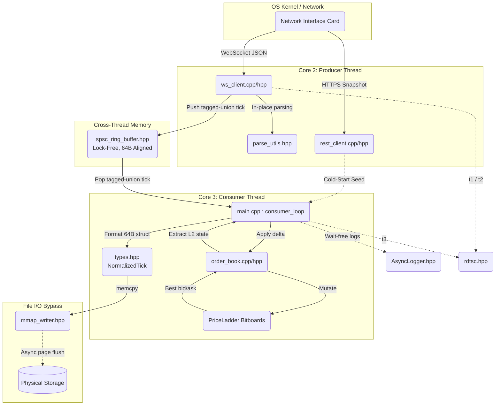

# L2 Market Data Gateway — Engineering Notes

> A C++20 ultra-low-latency, HFT-style ingestion pipeline for Level-2 crypto market data. Engineered around the principles of mechanical sympathy: zero-copy memory-mapped persistence, branchless logic, strict thread affinity, and bitwise data structures. Achieved **p99 queue transit latency of 7.4 µs** under volatile, news-driven conditions.

---

## Table of Contents

1. [Architectural Thesis](#1-architectural-thesis)
2. [Global Pipeline Execution](#2-global-pipeline-execution)
3. [System Topology & Data Flow](#3-system-topology--data-flow)
4. [Component Specifications](#4-component-specifications)
   - [4.1 Producer Path (Core 2)](#41-producer-path-core-2)
   - [4.2 Bootstrap (Cold Path)](#42-bootstrap-cold-path)
   - [4.3 Inter-Thread Transport](#43-inter-thread-transport)
   - [4.4 Consumer State Engine (Core 3)](#44-consumer-state-engine-core-3)
   - [4.5 Persistence](#45-persistence)
   - [4.6 Process Infrastructure](#46-process-infrastructure)
5. [Cross-Cutting Foundations](#5-cross-cutting-foundations)
6. [Latency Profile & Production Guarantees](#6-latency-profile--production-guarantees)
7. [References](#7-references)
8. [Incident Report — 2026-09-15: Hyperliquid Live-Data Latency Anomalies](#8-incident-report--2026-09-15-hyperliquid-live-data-latency-anomalies)
9. [Follow-up — 2026-09-15: WSL2 Migration, Validated Against Live Data](#9-follow-up--2026-09-15-wsl2-migration-validated-against-live-data)
10. [Correction — 2026-09-16: The Queue-Wait "Scheduler Quantum" Tail Was Self-Inflicted](#10-correction--2026-09-16-the-queue-wait-scheduler-quantum-tail-was-self-inflicted)
11. [Correction — 2026-09-16: Five Measurement Defects That Manufactured Their Own Tail](#11-correction--2026-09-16-five-measurement-defects-that-manufactured-their-own-tail)

---

## 1. Architectural Thesis

This document is the architectural thesis and technical specification for the L2 Market Data Gateway. The system is engineered strictly around the principles of *mechanical sympathy* — designing software such that its execution patterns map cleanly onto the underlying hardware (CPU caches, branch predictors, memory hierarchy, OS scheduler). It functions as an ultra-low-latency, HFT-style data ingestion pipeline.

The optimizations layered into the codebase — zero-copy memory-mapped persistence, branchless logic, strict thread affinity, hierarchical bitwise data structures, lock-free SPSC transport, and hardware-clock latency profiling — combine to deliver a **p99 queue transit latency of 7.4 µs** during volatile, news-driven market conditions.

### Core Design Tenets

- **Hot path vs. cold path.** Heavy optimization is reserved for the WebSocket ingestion and order-book mutation hot loops. Bootstrap (REST snapshot) and recovery paths use standard blocking I/O and prioritize correctness over speed.
- **Zero allocation on the hot path.** All memory required during steady-state is pre-allocated during initialization. `new`/`malloc` are eradicated from the hot loop.
- **Determinism over raw speed.** Bounded, predictable latency is more valuable than unpredictably-fast execution. Worst-case behavior must be known and reproducible.
- **Hardware-aware data structures.** Data layout is designed around 64-byte cache lines, NUMA topology, and CPU intrinsics — not around theoretical Big-O.
- **The OS is an adversary.** Kernel-mediated context switches, dynamic priority adjustments, and unbounded I/O syscalls are systematically engineered out of the hot path.

---

## 2. Global Pipeline Execution

The lifecycle of a single market-data tick through this gateway operates on nanosecond tolerances, meticulously avoiding the OS scheduler and standard memory allocators.

1. **Network Ingress.** A raw WebSocket frame arrives at the NIC and is deposited into kernel memory. The pinned Producer thread (Core 2), spinning on a synchronous socket read via Boost.Beast, pulls the payload directly into a pre-reserved `beast::flat_buffer`.
2. **Hardware Profiling (Point A).** The moment the buffer is available, `__rdtscp` is executed to capture the absolute hardware timestamp, anchoring the start of the `parse_cycles` metric.
3. **Zero-Copy Parse.** The `simdjson` parser reads the buffer in place. The dispatcher routes the payload to `parse_depth` or `parse_agg_trade`. Instead of generating strings, the customized `parse_scaled` function translates ASCII prices into `int64_t` ticks using pure ALU multiply-and-accumulate logic.
4. **Queue Transit.** The fully parsed payload is constructed directly into a pre-allocated `std::variant` slot inside the `SpscRingBuffer`. A second `__rdtscp` timestamp is embedded in the tick to measure queue transit, and the `head_` atomic pointer is advanced using `std::memory_order_release`.
5. **Consumer Activation.** The pinned Consumer thread (Core 3), running a spin-yield-poll loop with `__builtin_ia32_pause`, observes the updated atomic pointer via `std::memory_order_acquire`.
6. **State Application.** The tick is popped from the queue. If it is a depth update, the contiguous `PriceLadder` bitboards are mutated. Hardware intrinsics (`__builtin_clzll` / `__builtin_ctzll`) immediately scan the 64-bit words to locate the new top-of-book in **O(1)**.
7. **Zero-Latency Disk Commit.** The mutated state is packaged into a strictly 64-byte-aligned `NormalizedTick`. `MmapWriter` increments its pointer and writes the 64-byte struct directly into pre-faulted, locked memory. The kernel asynchronously flushes those pages to NVMe outside the execution flow of the trading thread.

---

## 3. System Topology & Data Flow



Threads are pinned to physical cores; `SpscRingBuffer` is the only shared mutable state, and it is touched via atomics with explicit acquire/release semantics. The `mmap_writer` and `AsyncLogger` are best understood as side-channels off the consumer thread — neither blocks the hot path.

---

## 4. Component Specifications

Each component below is documented in three layers: **Core Purpose**, **Concept & Theory** (the hardware/HFT principles being applied), and **Architect's Thought Process** (the design decisions and trade-offs). Where present, an **Implementation Notes** subsection captures specific code-level details from the working notes.

---

### 4.1 Producer Path (Core 2)

#### 4.1.1 `ws_client.hpp` / `ws_client.cpp`

**Core Purpose.** Ingests live WebSocket payloads directly into memory, parsing and pushing them onto the lock-free queue.

**Concept & Theory.** Uses Boost.Beast for asynchronous I/O and `simdjson` for zero-copy DOM traversal. Memory vectors (`scratch_bids_` and `scratch_asks_`) are pre-allocated at startup using `.reserve(256)`. WebSocket itself is a full-duplex, persistent channel over a single TCP connection — unlike HTTP's request-response model, the server can push data instantly, which is essential for order-book deltas. The `wss://` variant runs WebSocket over TLS, providing encryption, authentication, and integrity for the data stream.

**Architect's Thought Process.** The `new` operator was aggressively eradicated from the hot loop. By parsing directly from the Boost ASIO network buffer using `simdjson::padded_string_view`, string copies are bypassed entirely. Exchange disconnects are treated as standard operational realities — handled with reconnection loops that flag the consumer to invalidate its sequence state without halting the process.

**Implementation Notes.**

- *Dependency injection by reference.* The constructor takes `ThreadQueue<Tick>& queue` and `std::atomic<bool>& stop_flag` by reference. There must be exactly one shared queue across threads, and `std::atomic<bool>` is intrinsically non-copyable — both threads must operate on the exact same synchronization object to shut down gracefully. Stored as `queue_` and `stop_flag_` members so the references survive past the constructor's stack frame.
- *Zero-copy ingress signature.* `void dispatch(const std::string& raw_msg)` — pass-by-value would force a duplication of the entire JSON payload on every tick. Pass-by-`const&` hands the function the address of the existing network buffer; `const` enforces read-only.
- *Output-parameter return path.* Parsers are written as `bool parse_depth(simdjson::dom::element data, Tick& tick)` rather than returning a `Tick`. The caller allocates the slot once (inside a queue cell), and the parser fills it in place. This eliminates an entire RVO/move chain that would otherwise touch heavy members (variant payloads, vector metadata).
- *Single long-lived parser.* `simdjson::dom::parser parser_` is declared once as a class member, never per-message. simdjson allocates internal scratch buffers lazily on first use; reusing the same parser object recycles those allocations across all messages.
- *Reactor vs. Proactor.* Boost.Asio implements the **Proactor** pattern — operations are initiated asynchronously, the OS performs the work, and a completion handler runs only when the operation finishes. This contrasts with Reactor (notify-on-readiness), which would require non-blocking I/O inside every handler.

---

#### 4.1.2 `parse_utils.hpp`

**Core Purpose.** An ultra-fast custom ASCII-to-integer parser converting exchange decimal strings into scaled `int64_t` tick values.

**Concept & Theory.** Three hardware-level concerns drive the design of this module.

*ASCII-to-integer in the ALU.* Decimal digits in JSON arrive as ASCII bytes (`'0'..'9'` = `0x30..0x39`). Subtracting `'0'` yields a 0–9 integer. The classic accumulator `value = value * 10 + (c - '0')` is a tight sequence of integer multiply, integer add, and ASCII subtract — all of which dispatch to the **Arithmetic Logic Unit (ALU)**. ALU ops have single-cycle throughput on every modern x86-64 core. By contrast, `std::stod`/`atof`-style parsers route through the **Floating-Point Unit (FPU)** or SSE scalar pipeline, which has higher latency and *non-deterministic rounding* governed by IEEE-754 mode bits.

*Branchless programming.* A naive parser branches per digit (`if (isdigit(c))`). Branchy code is at the mercy of the CPU's Branch Prediction Unit; mispredictions flush the pipeline (~15–20 cycles, ≈5–7 ns at 3 GHz). Branchless variants — using arithmetic identities, conditional moves (`cmov`), or saturating arithmetic — eliminate the prediction problem entirely. For HFT, financial data formats are highly predictable (fixed-width digit counts, consistent decimal placement), so even a few branches in the loop are reliably predicted; but eliminating them removes the *worst-case* tail entirely.

*Bypassing the FPU for determinism.* The FPU is fast but its results are not bit-exact across CPUs, compiler versions, or rounding-mode configurations. In a financial system, a 1-ULP discrepancy in a price comparison can cause a different order-matching decision on two otherwise-identical machines. Integer arithmetic is bit-exact across every x86-64 (and ARM64) CPU ever shipped. Fixed-point integer math gives the precision of a `double` with the determinism of an `int64_t`.

**Architect's Thought Process.** The `[[gnu::always_inline]]` directive is applied to a specialized loop that sequentially processes ASCII digits using simple multiply-and-accumulate logic (`value = value * 10 + d`). This guarantees perfect determinism for financial rounding, keeps execution in the ALU, and lets modern branch predictors saturate to near-100% accuracy because financial-data formats are extremely regular. Standard-library parsers like `std::from_chars`, while better than `stod`, still carry generalized radix support, error-state machinery, and locale-related abstractions that bloat the inlined assembly.

**Implementation Notes.**

- The output is always a scaled integer (e.g., `50000.10` becomes `500001` with `PRICE_SCALE = 10`), feeding directly into the order-book index calculations without any further conversion.
- Loop body is intentionally tight: read byte → subtract `'0'` → multiply accumulator by 10 → add digit. No bounds-check inside the inner iteration; bounds are enforced by the JSON-element length read once on entry.

**References (theory).**
- Intel® 64 and IA-32 Architectures Software Developer's Manual, Vol. 1 — *Basic Architecture* (ALU vs. FPU pipelines).
- Agner Fog — *Optimizing software in C++* and *The microarchitecture of Intel, AMD and VIA CPUs* (latency tables, branch prediction).
- cppreference — `std::from_chars` / `std::to_chars` semantics.

---

### 4.2 Bootstrap (Cold Path)

#### 4.2.1 `rest_client.hpp` / `rest_client.cpp`

**Core Purpose.** Synchronous HTTP/REST data fetching to bootstrap the initial L2 limit-order-book state before WebSockets can take over.

**Concept & Theory.** Uses Boost.Beast and OpenSSL (TLS 1.3) to communicate with the venue securely, and `simdjson` to parse the snapshot payload — `simdjson` leverages SIMD vector extensions to parse JSON at multi-GB/s. Since this code path is exercised only at startup or after an unrecoverable sequence gap, blocking I/O is acceptable.

**Architect's Thought Process.** Heavy optimization is constrained to the WebSocket hot path. The cold path prioritizes reliability and clean initialization. The function is intentionally a free-standing function rather than a class — this is a one-and-done operation with no long-lived state; signaling stateless design to a reviewer (or interviewer).

**Implementation Notes — Fail-Fast Philosophy.** The function is documented as throwing `std::runtime_error` on network or parse failure. In trading systems, *doing nothing is vastly preferable to doing the wrong thing*. If the initial book cannot be fetched and the program silently proceeds with an empty book, downstream quantitative models will immediately make catastrophic decisions on phantom liquidity. Throwing on startup deliberately crashes the program — the **fail-fast** principle.

**Implementation Notes — RVO.** The function signature returns `OrderBookSnapshot` by value:

```cpp
OrderBookSnapshot fetch_depth_snapshot(const std::string& symbol = "BTCUSDT",
                                       int                limit  = 1000);
```

Modern compilers guarantee Return Value Optimization: the snapshot object is constructed directly in the caller's memory space. There is zero copying despite the by-value signature. `const std::string&` for `symbol` ensures no string copy on argument pass.

**Network-Stack Foundations Exercised.**

| Step | Latency Budget | Notes |
| --- | --- | --- |
| **DNS resolution** | 10–100 ms | UDP query to port 53. Production HFT pre-resolves IPs at startup or hardcodes them in `/etc/hosts` to bypass DNS on critical paths. |
| **TCP three-way handshake** | 1× RTT | SYN → SYN-ACK → ACK before any application data flows. |
| **TLS 1.3 handshake** | 1× RTT | Halved from TLS 1.2's 2 RTT. Uses ECDHE for key exchange, AES-256-GCM for the bulk cipher. |
| **Certificate-chain validation** | sub-ms | Verifies signatures, expiry, revocation (CRL/OCSP), and hostname (CN/SAN). Root CAs loaded from the OS trust store. |
| **SNI extension** | — | Required so the load balancer can present the correct cert when one IP fronts many domains. |
| **HTTP/1.1 request** | sub-ms | Persistent connection (Keep-Alive), `Host` header mandatory, optional chunked transfer encoding. |

**Production-Infrastructure Context.**

- *CDN.* Edge servers near the user reduce origin-server round trips. Public (Cloudflare, Akamai), private (Netflix Open Connect), or hybrid deployments. Distinguishes push (proactive upload) from pull (lazy fetch on first request) caches.
- *Load balancer.* Distributes traffic across resource servers using algorithms like Round Robin, Least Connections, Least Time, URL Hash, Source IP Hash, or Consistent Hashing. Operates at OSI Layer 4 (transport, IP/TCP routing) or Layer 7 (application, HTTP-header content switching).

---

### 4.3 Inter-Thread Transport

#### 4.3.1 `spsc_ring_buffer.hpp`

**Core Purpose.** The central nervous system of the architecture: a wait-free, lock-free queue that transfers ticks from the Producer thread to the Consumer thread.

**Concept & Theory.** Three foundational concepts justify this data structure's existence.

*Wait-free vs. lock-free vs. blocking.* A **blocking** synchronization (`std::mutex`, `std::condition_variable`) suspends a contending thread, requiring the OS scheduler to wake it later — costing microseconds for a context switch. A **lock-free** algorithm guarantees that *some* thread makes system-wide progress at every step, but an individual thread can theoretically be starved indefinitely. A **wait-free** algorithm strengthens this: *every* thread makes progress in a bounded number of its own steps, regardless of contention. The Single-Producer/Single-Consumer (SPSC) contract is the simplest case where wait-free progress is achievable using only `std::atomic` reads and writes — there is exactly one writer for `head_`, exactly one writer for `tail_`, so no compare-and-swap loop is needed and no thread can ever block another.

*Memory barriers and acquire/release semantics.* The CPU and the compiler are both free to reorder memory operations as long as single-threaded behavior is preserved. In multi-threaded code this is catastrophic — a producer might publish the `head_` index before the payload it points to is actually written to memory, so the consumer reads garbage. The C++ memory model exposes this control through `std::memory_order`:

- `memory_order_relaxed` — atomicity only, no ordering. Cheap (a normal load/store on x86), but no cross-thread visibility guarantees beyond the atomic itself.
- `memory_order_release` — applied to a *store*. All memory writes that **precede** this store in program order become visible to any thread that performs an *acquire* load on the same atomic. This is how the producer "publishes" payload-then-index.
- `memory_order_acquire` — applied to a *load*. All subsequent memory reads in this thread see the values written before the matching release store. This is how the consumer "subscribes" to the publication.
- `memory_order_seq_cst` — full sequential consistency, the strongest and slowest. Requires a full memory fence (e.g., `MFENCE` on x86) and a global modification order across all threads. Avoided here as overkill.

The producer pairs `tail_.store(new_tail, std::memory_order_release)` with the consumer's `tail_.load(std::memory_order_acquire)`. On x86-64, this pairing compiles to ordinary `MOV` instructions — the platform's memory model already provides Total Store Ordering — but the C++ annotations are still required so the *compiler* does not reorder the surrounding loads and stores.

*False sharing and cache-line ping-ponging.* CPU caches operate at 64-byte cache-line granularity. If `head_` (written by the producer) and `tail_` (written by the consumer) sit on the same 64-byte line, every producer write invalidates the consumer's copy of that line under the **MESI** coherence protocol — even though the two threads never touch the *same* variable. The line "ping-pongs" between cores via the inter-core fabric, costing tens of cycles per access. The fix is `alignas(64)` padding around each atomic so they occupy separate cache lines, and a similar separation between the atomics and the buffer payload.

**Architect's Thought Process.** The buffer size `N` is enforced as a power-of-two via `static_assert`, allowing the modulo operation `index % N` to compile to a single-cycle bitwise AND `index & (N - 1)` rather than an integer DIV instruction (which is one of the slowest x86 ops, often >20 cycles). By separating `head_`, `tail_`, and the buffer payload itself with `alignas(64)`, the producer modifying `head_` never invalidates the consumer's L1 line containing `tail_`, achieving the highest possible memory-bus throughput. Combined with relaxed atomics for self-reads (a thread reading its own head/tail does not need ordering against itself) and acquire/release only across the producer/consumer boundary, this delivers near-bare-metal queue transit.

**Why Not the Mutex Queue?** See `thread_queue.hpp` below — the migration was deliberate. The mutex version is the latency floor; the SPSC ring is the ceiling-buster.

**References (theory).**
- C++ Standard, `[atomics.order]` — formal definition of memory_order.
- Herb Sutter — *atomic<> Weapons* (CppCon 2012, parts 1 & 2).
- Martin Thompson — *Mechanical Sympathy* blog, especially posts on the LMAX Disruptor (the canonical SPSC ring).
- Paul McKenney — *Is Parallel Programming Hard, And, If So, What Can You Do About It?* (free PDF, definitive memory-model reference).
- Ulrich Drepper — *What Every Programmer Should Know About Memory* (cache lines, MESI, false sharing).
- Intel SDM Vol. 3, *Memory Ordering* chapter.

---

#### 4.3.2 `thread_queue.hpp` (Legacy / Reference)

**Core Purpose.** A traditional locking queue using `std::mutex` + `std::condition_variable`.

**Concept & Theory & Thought Process.** Acts as a baseline/legacy reference. The codebase deliberately migrated away from this structure to `SpscRingBuffer` in `main.cpp` (referenced internally as "FIX 3"). Condition-variable wakeups introduce an unacceptable latency floor due to OS-mediated thread scheduling.

**Implementation Notes — RAII Locking.**

```cpp
void push(T item) {
    {
        std::lock_guard<std::mutex> lk(mutex_);
        queue_.push(std::move(item));
    }                       // <-- lock released HERE
    cv_.notify_one();       // <-- notify with lock NOT held
}
```

The inner brace-block scope is intentional. If `notify_one()` ran while the lock was still held, the consumer thread would wake up only to crash into a still-locked door, get put back to sleep, and incur a second wake-up cycle once the producer scope finally ended. Releasing the lock before signaling is the canonical pattern.

**Implementation Notes — Spurious Wakeups.**

```cpp
T pop() {
    std::unique_lock<std::mutex> lk(mutex_);
    cv_.wait(lk, [this] { return !queue_.empty(); });
    T item = std::move(queue_.front());
    queue_.pop();
    return item;
}
```

The lambda predicate is non-negotiable. Operating systems can issue *spurious wakeups* — a thread on `cv_.wait()` resumes without any matching `notify_one()`. Without the predicate, the consumer would call `front()` on an empty queue and segfault. With it, the wait re-checks the queue state on every wake; a false alarm puts the thread immediately back to sleep.

**Implementation Notes — `mutable` Mutex.** A `const`-qualified `size()` method must still lock the mutex internally; locking mutates the mutex's internal state. The `mutable` keyword on `std::mutex mutex_` exempts it from the `const` contract — a sanctioned exception to physical const-ness.

**Critical-Section Discipline.**

- *Anti-pattern.* Lock → pop → parse JSON → mutate book → unlock. While the consumer holds the lock through parsing and book mutation, the producer cannot push the next tick. Network buffers fill, packets drop, the order book lags reality.
- *Correct pattern.* Lock → pop → unlock → parse → mutate. The lock spans only the pointer-move into local memory. Heavy work happens after release.

**Why the SPSC Migration Was Worth the Effort.** A correct lock-free SPSC ring requires deep understanding of (1) memory ordering and (2) cache-line bouncing. Get either wrong and the "lock-free" queue is *slower* than the mutex it replaced. Day-1 ships the mutex version — correctness over speed. Day-N migrates to atomics once the mutex's contention is empirically verified to be the bottleneck.

---

### 4.4 Consumer State Engine (Core 3)

#### 4.4.1 `order_book.hpp` / `order_book.cpp`

**Core Purpose.** Represents the L2 limit order book. Anchors prices to a flat, contiguous memory array rather than a node-based tree.

**Concept & Theory.** A `std::map` is implemented as a red-black tree. It maintains sort order automatically, providing O(log n) insertion and instant access to `begin()` (best bid/ask). But every node is a separate heap allocation, scattering the book across memory pages and guaranteeing cache misses on every traversal. In an HFT context, "log n" with constant cache misses is dominated by O(n) on contiguous memory.

The `PriceLadder` reserves a massive contiguous array (`2'000'000` levels) to span the price space at tick granularity. Ticks are computed as `idx = (price - base) / PRICE_SCALE`, giving direct array indexing — no tree walk, no allocation, no hashing.

**Architect's Thought Process.** To make best-bid/ask lookups **O(1) under all market conditions**, the architect implemented a hierarchical bitboard (`L1` and `L2` bit arrays). Hardware intrinsics — `__builtin_clzll` (count leading zeros) and `__builtin_ctzll` (count trailing zeros) — let the CPU scan thousands of price levels in single-cycle bitwise operations rather than iterative loops. Memory resets are achieved with a single `std::memset`, drastically outperforming the O(N) destructor cascade of a node-based map.

**Implementation Notes — Fixed-Point Pricing.** The book stores prices as scaled `int64_t` ticks, never floating-point. With `PRICE_SCALE = 10000`, a 1-tick spread `bid=1001000`, `ask=1002000` divides cleanly: `mid = (best_bid + best_ask) / 2 = 1001500`. The PRICE_SCALE creates implicit "sub-ticks" that allow integer division to be precise on odd numerators — half-tick precision without ever touching the FPU.

**Implementation Notes — Sequence-Gap Detection.**

```cpp
if (last_u_ != 0 && upd.pu != last_u_) {
    // GAP — book is now a corrupted mirror of reality
}
```

Every Binance update carries `u` (this update's ID) and `pu` (the previous update's ID). Mismatch = a packet was missed = the local book is wrong. The local book may now show liquidity that no longer exists (slippage) or miss levels that were added (mispricing). **Production recovery sequence:**

1. Halt strategy — no new orders.
2. Cancel all open orders.
3. Clear the `PriceLadder` to zero.
4. Tear down the WebSocket connection.
5. Reconnect WebSocket.
6. Fetch a fresh REST snapshot (ground-truth reset).
7. Apply snapshot to the `PriceLadder`.
8. Resume the WebSocket stream from the snapshot's `last_update_id`.
9. Discard any WS packet where `upd.u <= snapshot_last_update_id` — these overlap the snapshot.
10. Resume strategy.

Modeled as a `BookState` enum: `LIVE → GAP_DETECTED → SNAPSHOTTING → REPLAYING → LIVE`. Returning `bool` from `apply_depth()` is the trigger that initiates the state-machine transition.

**Implementation Notes — Single-Branch Bounds Check.** A naive bound check uses two comparisons: `if (idx < 0 || idx >= MAX_LEVELS)`. The optimization:

```cpp
if (static_cast<uint64_t>(idx) >= MAX_LEVELS) return false;
```

Two's-complement representation guarantees that any signed-negative `idx`, reinterpreted as `uint64_t`, becomes a value larger than any sane `MAX_LEVELS` (e.g., `-1` becomes `2^64 − 1`). One comparison, one branch. Saves ~15–20 cycles on the rare misprediction.

**Implementation Notes — Hierarchical Bitboard Detail.**

| Tier | Size | Role |
| --- | --- | --- |
| `qtys[]` | 20,000 levels | Actual quantity at each price tick. |
| `L1` bitboard | 313 × `uint64_t` (2,504 B — fits in L1 cache) | One bit per price level: 1 means `qtys[idx] > 0`. |
| `L2` bitboard | 5 × `uint64_t` (40 B — one cache line) | One bit per L1 word: 1 means "that L1 chunk has at least one occupied level." |

*Search*: `__builtin_clzll(L2_word)` → finds occupied L1 chunk (1 cycle). `__builtin_clzll(L1_word)` → finds exact tick (1 cycle). Total: **2 cycles**, regardless of whether the move is 1 tick or 19,999 ticks.

*Maintenance cost*: every `set()` updates three things — `qtys[idx] = qty`, `L1 |= (1ULL << bit)`, `L2 |= (1ULL << bit)`. Two extra bitwise ORs, sub-nanosecond, executed in parallel with the array store via out-of-order execution.

*The volatility paradox solved*: a flash crash that wipes 500 levels — or 19,999 levels — finds the new best price in the same 2 cycles. The system's worst case is bounded and known. **Determinism is more valuable than raw average speed.**

**Implementation Notes — Asks vs. Bids Map Direction.** In the legacy map-based path, `asks_` uses default `std::less` (ascending) so `asks_.begin()` is the lowest sell — the best ask. `bids_` uses `std::greater<int64_t>` (descending) so `bids_.begin()` is the highest buy — the best bid. The two map types are technically different C++ types, requiring two overloads of `apply_levels(...)`.

**Implementation Notes — Default Member Initialization.**

```cpp
int64_t last_update_id_ = 0;
int64_t last_u_         = 0;
bool    seeded_         = false;
```

In-class initializers guarantee that a freshly constructed `OrderBook` has zeroed state before `seed()` runs — protects against reading garbage RAM.

**References (component-specific).**
- WK Selph — *How to Build a Fast Limit Order Book* (the canonical price-ladder blog post).
- Databento — *How to Build a Book* (production walkthrough).
- Chess Programming Wiki — *Bitboards* (same technique, originally from chess engines).
- Linux Kernel `O(1)` scheduler bitmap design (Robert Love, *Linux Kernel Development*, Ch. 4).
- Jane Street tech blog — order-book / systems posts.
- DPDK Programmer's Guide — bitboard/intrinsics in packet-classification fast paths.
- GCC documentation — *Other Built-in Functions* (`__builtin_clzll`, `__builtin_ctzll`).

---

#### 4.4.2 `types.hpp`

**Core Purpose.** Global data models enforcing strict byte boundaries, fixed-point math scales, and optimal struct packing.

**Concept & Theory.** CPU caches fetch memory in 64-byte chunks (cache lines). Misaligned data forces the CPU to fetch *two* cache lines for a single access. The `NormalizedTick` struct uses `__attribute__((packed))` and explicit bit-fields (e.g., `event_time : 56`) to consume exactly 64 bytes — perfectly aligned with one cache line.

**Architect's Thought Process.** By enforcing a strict 64-byte layout, one `NormalizedTick` perfectly aligns with exactly one CPU cache line. Using `std::variant<DepthUpdate, AggTrade>` for queue payloads lets the SPSC buffer allocate a uniform memory block sized to the largest alternative — no runtime heap allocations while still transferring diverse event types.

**Implementation Notes — Why `int64_t`.** Supports very large values (Binance prices × `PRICE_SCALE = 10` fits comfortably). Prevents overflow in cumulative PnL computations. Ensures deterministic arithmetic — no rounding errors, ever.

**Implementation Notes — Why `static constexpr`.**

```cpp
static constexpr int64_t PRICE_SCALE = 10;
static constexpr int64_t QTY_SCALE   = 1000;
```

`constexpr` puts the value in the compile-time constant table — zero runtime overhead, no memory load. `static` restricts internal linkage to the translation unit — no ODR conflicts. Cannot be modified accidentally.

**Implementation Notes — Floating-Point in Trading Is Forbidden.** `0.1 + 0.2 = 0.30000000000000004` because `0.1` is a non-terminating binary fraction. Across millions of operations, error accumulation causes incorrect PnL, mismatched orders, and false risk-check failures. Fixed-point integers eliminate the entire class of bugs. Binance defines per-symbol precision via `tickSize` and `stepSize`; for `BTCUSDT` Futures, `tickSize=0.10` ⇒ `PRICE_SCALE = 1/0.10 = 10`, `stepSize=0.001` ⇒ `QTY_SCALE = 1000`.

**Implementation Notes — `std::variant` over Tagged Struct.** The naive design is a struct holding both `DepthUpdate` and `AggTrade` plus a `TickType` enum — which means *both* members occupy memory in *every* tick, even though only one is used. `DepthUpdate` contains `std::vector` members, so this design also drags vector metadata around for AggTrade events. `using TickData = std::variant<DepthUpdate, AggTrade>;` stores only the active type, sized to the largest alternative, with the variant index encoding which type is live. Smaller per-tick footprint = better cache locality = higher inter-thread queue throughput. The variant also enforces type safety at compile time and removes the redundant `TickType` enum (variant index *is* the discriminant).

**References.**
- Algorithmica — *Alignment and Packing*.
- Mike Acton — *Data-Oriented Design and C++* (CppCon 2014).
- Timur Doumler — *Want fast C++? Know your hardware*.
- Stephan T. Lavavej — *Floating-Point `<charconv>`* (CppCon 2019).

---

### 4.5 Persistence

#### 4.5.1 `mmap_writer.hpp`

**Core Purpose.** Cross-platform, zero-copy binary persistence of tick data directly to mapped memory.

**Concept & Theory.** Four hardware/OS concepts justify this design.

*Zero-copy persistence.* A traditional `write()` syscall takes a user-space buffer and copies it into a kernel buffer, then the kernel asynchronously flushes the kernel buffer to the disk controller. That user→kernel copy is pure overhead. A memory-mapped file collapses the abstraction: the file is *literally part of the process's virtual address space*. Writing to the mapped region is just writing to memory; the kernel's page-cache machinery handles persistence transparently.

*Bypassing kernel I/O syscalls.* Each `write()` triggers a user-space ↔ kernel-space transition. On x86-64, this involves a `SYSCALL` instruction, register save/restore, ring-0 entry, the kernel's own argument validation and work, and a `SYSRET` to return. Even fast paths cost hundreds of cycles, plus cache disturbance from kernel-side code execution. With `mmap`, the only syscall is the *one-time* `mmap()` call at startup. Steady-state writes are pure user-space stores.

*Page-fault avoidance via warm-up.* When a memory-mapped region is first touched, the OS lazily allocates the corresponding physical page — a *minor page fault*. If the file is on disk and not yet read, the access triggers a *major page fault* requiring a disk read, suspending the thread for milliseconds. In an HFT hot path, even a single major page fault is catastrophic. The fix is the `warm_up()` routine, which:

1. Pre-faults every page by writing zeroes across the entire region — converting all future first-touches into already-resident hits.
2. Locks pages into physical RAM with `mlock` (POSIX) or `VirtualLock` (Windows) — preventing the kernel from paging them out under memory pressure.

After warm-up, every subsequent write is a pure userspace store into resident, locked memory.

*Virtual-memory mapping.* The CPU's MMU translates virtual addresses to physical RAM frames via the page table. The TLB caches recent translations; a TLB hit is ~1 cycle, a TLB miss requires a multi-level page walk through main memory (tens to hundreds of cycles). Sequential writes into a contiguous mmap region maximize TLB hit rate because consecutive writes hit the same page until the page boundary is crossed. Optionally, *huge pages* (2 MB on x86-64 vs. the default 4 KB) reduce page-walk depth by 9 bits — recommended for the production deployment of `MmapWriter` on high-throughput days.

**Architect's Thought Process.** The architect identified disk I/O as a fatal bottleneck and bypassed it entirely. By writing the `NormalizedTick` array directly into the memory map, the critical path executes as a pointer increment + a 64-byte memory copy. The kernel's virtual-memory subsystem asynchronously flushes pages to disk *outside the execution flow of the trading thread*. The thread never blocks on I/O; durability is opportunistic and tunable (e.g., periodic `msync` on a separate thread for crash-recovery guarantees).

**References (theory).**
- *mmap(2)* and *mlock(2)* Linux man pages.
- Microsoft Win32 docs — *MapViewOfFile* and *VirtualLock*.
- Ulrich Drepper — *What Every Programmer Should Know About Memory* (virtual memory and TLB).
- Intel SDM Vol. 3 — *Paging* and *VMX Page Walking*.
- LWN.net — *Transparent huge pages* article series.

---

### 4.6 Process Infrastructure

#### 4.6.1 `main.cpp`

**Core Purpose.** System entry point that orchestrates thread spawning, core pinning, hardware-timing calibration, and graceful POSIX signal handling.

**Concept & Theory.** Operating systems natively load-balance threads across cores, causing unpredictable context switches and L1/L2 cache evictions. `main.cpp` actively fights the scheduler by promoting the process priority via `REALTIME_PRIORITY_CLASS` (Windows) or `SCHED_FIFO` (Linux), and pinning the data threads to Core 2 (Producer) and Core 3 (Consumer).

**Architect's Thought Process.** The `OrderBook` is allocated dynamically (`std::make_unique`) exclusively *inside* the consumer thread, so there is zero shared mutable state between threads other than the SPSC ring — eliminating mutexes by construction. The consumer's spin-poll loop uses adaptive backoff with the CPU `PAUSE` instruction (`__builtin_ia32_pause`) to hint the processor that a spin-wait is in progress; this prevents pipeline starvation, avoids speculative-execution penalties on memory ordering, and reduces power consumption on idle cycles.

**Implementation Notes — Signal Handling.** Signal handlers run *asynchronously* — they can interrupt the main thread at any machine instruction. Almost everything is unsafe inside a handler:

- `std::cout`, `printf`, `malloc`, `std::string`, `std::vector` — all rely on internal locks or heap allocation. Reentrancy can deadlock the thread against itself.
- The C++ runtime is *not* async-signal-safe.

The minimal-legal signal handler does only:

1. Set lock-free atomics: `g_stop.store(true, std::memory_order_relaxed)` — relaxed is sufficient because no other memory needs to synchronize through this store, just the atomic mutation itself; relaxed avoids unnecessary memory fences.
2. Call strictly async-signal-safe POSIX functions: `write(STDOUT_FILENO, "...", n)` with a pre-allocated `static const char[]`.
3. Return.

Anything else is undefined behavior.

---

#### 4.6.2 `thread_utils.hpp`

**Core Purpose.** Encapsulates the logic for binding application threads to specific hardware CPU cores.

**Concept & Theory.** Four foundational concerns.

*NUMA architecture.* On modern multi-socket servers — and increasingly on chiplet-based desktop CPUs (AMD Ryzen, Intel hybrid P/E cores) — memory is **Non-Uniform**. Each socket (or chiplet) has its own integrated memory controller and a "local" portion of system RAM. Accessing memory attached to a *remote* socket must traverse the inter-socket interconnect (Intel UPI / AMD Infinity Fabric), incurring a 1.5–3× latency penalty over local access. NUMA-aware code allocates memory on the same node where the consuming thread runs, and pins both together so the OS scheduler cannot migrate the thread away from its memory.

*CPU cache hierarchies.* Modern CPUs have at least three levels of cache:

| Level | Size (typical) | Latency | Scope |
| --- | --- | --- | --- |
| L1d / L1i | 32–48 KB each, per-core | ~3–5 cycles | Private to one core |
| L2 | 256 KB – 2 MB, per-core | ~10–15 cycles | Private (or shared between sibling SMT threads) |
| L3 (LLC) | 8–96 MB | ~30–50 cycles | Shared across all cores in a socket |
| Main RAM | ~GB–TB | ~200+ cycles (much higher across NUMA) | System-global |

When a thread migrates between cores, its working set is cold-started in the new core's L1/L2. The first thousand or so memory accesses post-migration each pay a cache-miss penalty — sometimes hundreds of cycles each. This is **why scheduler migration is poison for low-latency code**, even if the destination core is "more idle."

*Thread affinity.* The OS exposes per-thread CPU bitmasks: `pthread_setaffinity_np` on Linux/POSIX, `SetThreadAffinityMask` on Windows. Setting a bitmask of exactly one bit *pins* the thread to that physical core (or hardware thread). Combined with a real-time scheduling class (`SCHED_FIFO`), this makes thread migration impossible without explicit reconfiguration. The producer is pinned to Core 2 and the consumer to Core 3 — adjacent physical cores on the same NUMA node and ideally sharing an L3 slice, so the SPSC ring's cache lines can ping between them via the L3 rather than across the inter-socket fabric.

*Avoiding scheduler context switching.* A context switch saves the entire register file (general-purpose, FPU/SSE, segment registers), updates the page-table base register, flushes parts of the TLB, and restores the same state for a different thread. The direct cost is 1–10 µs depending on the workload; the indirect cost (cache pollution from the new thread's working set) can be much higher. Pinning + real-time priority + a workload that never voluntarily yields means the scheduler effectively cannot preempt the thread — modulo hardware interrupts, which can be redirected to other cores via IRQ affinity.

**Architect's Thought Process.** The architect uses *internal self-pinning* (`pin_thread_self`) from inside the lambda body that the thread executes, rather than external pinning from the spawning thread. This bypasses limitations in the MinGW `winpthreads` wrapper, where converting external thread handles is unreliable. Self-pinning runs once on the new thread's own stack with its own native handle, which works consistently on Linux (POSIX) and Windows (MinGW) targets.

**References (theory).**
- *pthread_setaffinity_np(3)* and *sched_setaffinity(2)* Linux man pages.
- Microsoft Win32 docs — *SetThreadAffinityMask*, *SetThreadPriority*.
- Linux NUMA documentation (`numa(7)`, `numactl(8)`).
- Ulrich Drepper — *What Every Programmer Should Know About Memory*, NUMA chapter.
- Carl Cook — *When a Microsecond Is an Eternity* (CppCon 2017) — exactly this design pattern.

---

#### 4.6.3 `AsyncLogger.hpp`

**Core Purpose.** Lock-free, wait-free asynchronous logging for hot-path trading threads.

**Concept & Theory.** Three concepts justify the design.

*Offloading I/O from the hot path.* A naive `std::cerr << "..."` is a *synchronous* OS syscall: it acquires a kernel-side lock, copies bytes into a kernel buffer, and may flush all the way to the terminal device. Latency: 1,000 to 100,000 ns. On a hot path running 1 M ticks/sec — a per-tick budget of 1 µs — a single log call blows the entire budget. The solution is to split logging into two stages running on two different threads:

```
Hot-Path Thread                Background Drain Thread
───────────────                ───────────────────────
write to ring buffer  ───→     read ring buffer
(~10 ns, never blocks)         → format → std::cerr (slow, isolated)
```

The hot-path call becomes a memory write — bounded, non-blocking, and immune to kernel scheduling.

*SPSC queue for logging.* The same SPSC ring-buffer pattern used for tick transport applies to log records. There is exactly one producer per logger instance (the hot-path thread for that core) and exactly one consumer (the drain thread). Wait-free atomics on `head_` and `tail_`, with `alignas(64)` separation to prevent false sharing — the drain thread's write to `tail_` must never invalidate the hot-path thread's cache line containing `head_`.

*Avoiding blocking syscalls and heap allocation.* Two non-obvious traps in a logging path:

- **`std::ostringstream` heap-allocates** internally. Equivalent latency cost to a blocking syscall in the worst case. The fix: format directly into a stack buffer with `snprintf`. `snprintf` is bounded, allocation-free, and async-signal-safe in modern libc implementations.
- **Buffer-full policy must be drop, not block.** If the ring is full (drain thread fell behind), the hot path *drops* the message rather than blocking. A full log buffer is a monitoring problem, not a reason to stall tick processing.

**Architect's Thought Process.** In an HFT pipeline, a trading thread must never yield its quantum to wait on I/O. The architect designed the logger to drop messages if the buffer is full rather than blocking. `std::memory_order_relaxed` for self-reads of the head and `std::memory_order_release` for publishing writes ensure cross-thread visibility without the cost of full memory barriers.

**Hot vs. Cold Path Rule.**

- *Hot path* (every tick): replace `std::cerr` with `logger().logf(...)`.
- *Cold path* (startup, recovery, config): leave `std::cerr` in place. It runs once, latency is irrelevant.

For example, `OrderBook::seed()` runs once at startup and once per recovery. Its `std::cout` calls are fine.

**References (theory).**
- Martin Thompson — *Mechanical Sympathy* blog, post on the LMAX logging architecture.
- spdlog / nanolog — open-source production async loggers worth studying.
- *write(2)*, *signal-safety(7)* Linux man pages.

---

#### 4.6.4 `rdtsc.hpp`

**Core Purpose.** Nanosecond-precision hardware latency profiling.

**Concept & Theory.** Four concerns drive this module's design.

*Nanosecond hardware profiling via the TSC.* Every modern x86-64 CPU exposes a 64-bit Time-Stamp Counter that increments at a fixed rate. The `RDTSC` instruction returns its current value in `EDX:EAX` in roughly 20–30 cycles — vastly faster and finer-grained than syscall-based timers (`clock_gettime` ≈ 20 ns minimum on a vDSO fast path; syscall-based `gettimeofday` is hundreds of ns). For sub-microsecond latency measurements, TSC reads are the only viable source.

*`RDTSC` vs. `RDTSCP`.* The plain `RDTSC` instruction is *not serializing*: the CPU's out-of-order engine is free to execute it before earlier instructions complete or after later ones begin. For latency measurement this is catastrophic — the timestamp might be captured *before* the operation it is supposed to time has even started, or *after* the operation it is supposed to bracket has finished. `RDTSCP` ("Read TSC and Processor ID") reads the same TSC but is *partially serializing*: it waits for all previous instructions to retire before sampling the counter, then samples the counter, then allows subsequent instructions to begin. It also returns the current logical-processor ID in `ECX`, which is useful for detecting thread migration mid-measurement.

*Speculative execution and instruction reordering.* Modern CPUs execute instructions out of program order to keep their pipelines full. Without serialization, the timing window can:

- *Start late.* The first `RDTSC` is reordered to execute *after* part of the work it is timing.
- *End early.* The second `RDTSC` is reordered to execute *before* the work it is timing has retired.

Either reordering produces a wildly under-counted or over-counted interval. The real elapsed time is unknowable without serialization.

*LFENCE and pipeline serialization.* The `LFENCE` instruction is a load-fence that also serializes the instruction stream — no later instruction may execute until all earlier instructions have retired. The classical Intel-recommended timing pattern is:

```asm
mfence            ; ensure prior stores are globally visible
lfence            ; serialize: drain the pipeline of in-flight ops
rdtsc             ; sample t0 now that the pipeline is empty
... work ...
rdtscp            ; sample t1; rdtscp is itself partially serializing
lfence            ; prevent later loads from being reordered before the sample
```

`RDTSCP` collapses the trailing `LFENCE` into an implicit barrier — a real-world simplification.

**Architect's Thought Process.** The architect noted that `RDTSC` alone is reordered by the CPU's speculative-execution engine, destroying measurement integrity. By switching to `RDTSCP`, an implicit `LFENCE` is executed, forcing a full pipeline serialization. The architect also dynamically calibrates the machine's GHz at runtime — sleeping a known wall-clock interval, measuring the cycle delta over that interval — so the codebase is robust against varying CPU base clocks across deployment hardware. This relies on the **Invariant TSC** feature (advertised in `CPUID.80000007H:EDX[8]`) — guaranteed on all Intel CPUs since Nehalem and AMD CPUs since Bulldozer — which keeps the TSC running at a constant rate independent of dynamic frequency scaling (Turbo Boost, C-states, etc.).

**Caveats.** TSCs across cores are usually but not always synchronized. On older multi-socket systems, cross-core comparisons could be off by hundreds of cycles. Modern hardware and Linux kernels (>3.x) generally synchronize TSCs at boot (`clocksource=tsc`), but production deployments should verify with `dmesg | grep -i tsc` or equivalent.

**References (theory).**
- Intel® 64 and IA-32 Architectures Software Developer's Manual, Vol. 2B — *RDTSC*, *RDTSCP*, *LFENCE* instruction reference.
- Intel — *How to Benchmark Code Execution Times on IA-32 and IA-64 Instruction Set Architectures* (Gabriele Paoloni white paper) — the canonical RDTSC/RDTSCP timing methodology.
- Agner Fog — *Optimizing assembly code* and *The microarchitecture of Intel/AMD/VIA CPUs*.
- Linux kernel documentation — `Documentation/x86/tsc.txt`.

---

## 5. Cross-Cutting Foundations

### 5.1 Memory Hierarchy & Caching

**Virtual ↔ physical address translation.** The CPU thinks in *virtual addresses*. Each address splits into a page number `p` and an offset `d`. The OS maintains a per-process *page table* mapping page numbers to physical *frame numbers* `f`. The translated physical address `(f, d)` is then sent to RAM hardware.

**The TLB.** Looking up the page table on every access would double the memory-access count. The **Translation Lookaside Buffer** is a small, ultra-fast associative cache of recent (page → frame) mappings.

- *TLB hit*: page found; physical address formed instantly.
- *TLB miss*: triggers a *page walk* through the page table in main memory — tens to hundreds of cycles. On large working sets, TLB pressure is a hidden tax. Huge pages (2 MB / 1 GB) are the standard mitigation.
- *Page fault*: the page is not even in physical RAM. Hard fault: load from disk (milliseconds — catastrophic in HFT). The `MmapWriter::warm_up()` exists specifically to convert all future faults into pre-resolved hits.

**Cache hits, misses, and miss types.**

- *Compulsory (cold) miss* — first-ever access to a cache line.
- *Capacity miss* — the working set is larger than the cache.
- *Conflict miss* — multiple memory blocks map to the same set in a set-associative cache.

**The grand execution flow.** Cache check → on miss, TLB check → on TLB miss, page-table walk → on page miss, page fault → page replacement → load page from disk. Each layer down is roughly 10× slower than the previous.

**Cache locality.**

- *Spatial locality*: if you accessed `X`, you are likely to access `X+1` soon. The CPU fetches a 64-byte line, not a single byte.
- *Temporal locality*: if you accessed `X`, you are likely to access `X` again soon.

**The prefetcher.** Modern CPUs detect linear access patterns and aggressively prefetch upcoming cache lines. Random access defeats it; sequential access feeds it. The `PriceLadder` is contiguous specifically to keep the prefetcher happy on top-of-book scans.

**Big-O lies for small data.** On an array of 16 elements, insertion sort outperforms quicksort. Cache locality + branch predictability dominate asymptotic complexity at small N. For the order-book bitboard, this insight inverts: O(1) bitboard wins not because of asymptotic complexity but because the entire L1/L2 bitboard fits in L1 cache and uses single-instruction CPU intrinsics.

**Matrix-multiply locality example.** The `i-j-k` loop ordering walks `B[k][j]` column-wise — a cache-line-sized stride per access — destroying spatial locality. The `i-k-j` ordering walks `B[k][j]` row-wise — perfect stride-1 access — and the prefetcher picks up the pattern. Same algorithm, same Big-O, but the second is 2–10× faster on real hardware.

**MESI cache coherence.** When multiple cores share a cache line, the **MESI protocol** keeps them consistent without funneling every access through main memory:

- *Modified* — line is dirty in this cache, not in any other.
- *Exclusive* — line is clean in this cache, not in any other.
- *Shared* — line is clean and may be in other caches.
- *Invalid* — line is stale, must be re-fetched.

State transitions happen via *bus snooping*. False sharing is fundamentally a MESI problem: two cores writing to disjoint variables on the same line still trigger M↔I transitions on every write.

**`alignas(64)` is the universal antidote.** Pad cross-thread atomics, queue head/tail pointers, and per-thread counters to their own cache lines.

---

### 5.2 Branch Prediction & Speculative Execution

**Pipelining and speculation.** Modern CPUs split instruction execution into stages (Fetch → Decode → Execute → Memory → Writeback) and process multiple instructions concurrently. At a conditional branch, the pipeline cannot proceed until the condition resolves — unless the CPU *guesses* and speculatively executes down the predicted path, retiring results only if the guess was correct.

- *Correct prediction*: ~0 added cycles. The speculation absorbs into the pipeline.
- *Misprediction*: ~15–20 cycles. The pipeline is flushed and refilled from the correct address.

**Prediction quality is everything.** A condition that is true 90% of the time predicts perfectly. A condition that is true exactly 50% of the time is a coin-flip — a worst-case predictor input. This is why branch *patterns* matter more than branch *count*.

**The algorithmic paradox.** Iterating an array and testing `if (data[i] >= 50)`:

- *Unsorted (O(n))*: predictor accuracy ~40%, pipeline flushes constantly.
- *Pre-sorted (O(n log n) sort + O(n) scan)*: predictor accuracy >80%, near-zero flushes.

The sorted version with mathematically *worse* total complexity executes faster on real hardware. Sorting once amortizes the cost of misprediction-free iteration.

**Hardware components.**

- *Branch Target Buffer (BTB)* — caches target addresses of past taken branches.
- *Return Stack Buffer (RSB)* — LIFO of return addresses for perfectly predicting `ret` instructions.

**Predictor designs (finite-automaton hierarchy).**

- *Static prediction* — fixed rules (e.g., backward branches predicted taken, forward predicted not-taken).
- *1-bit predictor* — 2-state DFA tracking last outcome. One misprediction flips its state; vulnerable to alternating patterns.
- *2-bit saturating counter* — 4-state DFA: Strongly Not Taken → Weakly Not Taken → Weakly Taken → Strongly Taken. Requires *two* consecutive contradictions to flip its prediction — much more resilient.
- *Two-level adaptive* — global or local history register indexes a Pattern History Table of 2-bit counters.
- *gshare* — XORs the global history with the program counter to reduce aliasing (XOR is reversible, so no information is lost).
- *Perceptron predictors* — used in modern AMD Zen. Replace the DFA with a single-layer neural-network-style weighted sum over global history. Hardware-trained weights adapt per-branch.

**Compiler-side mitigation.** Modern compilers will often automatically rewrite simple conditionals into branchless code using `cmov` or arithmetic identities. `[[likely]]` / `[[unlikely]]` C++20 attributes hint at branch direction.

**Spectre — the security cost.** Speculative execution leaves a footprint in the cache even when the speculation is rolled back. An attacker can train the predictor to speculatively read out-of-bounds memory, then use cache-timing measurements to extract those values. Speculative-side-channel attacks fundamentally exploit the gap between *architectural state* (rolled back on misprediction) and *micro-architectural state* (cache, predictor) which is *not*.

**References.**
- Agner Fog — *The microarchitecture of Intel, AMD and VIA CPUs*.
- Educative — *What is Branch Prediction?*
- Dev.to — *Branch Prediction: All Processors* (D. Lazarev).
- Medium / Demistify — *CPU Branch Prediction: Earliest Forms of Machine Learning*.

---

### 5.3 Concurrency Primitives & Memory Ordering

**Process vs. thread.** A *process* is an independent program with its own virtual address space — heavyweight to create. A *thread* is a unit of execution *inside* a process, sharing the address space with sibling threads — cheap to create, no cross-process IPC needed.

**Data race.** Three conditions: (1) two threads access the same memory location concurrently, (2) at least one access is a write, (3) no synchronization primitive coordinates them. Result: **undefined behavior** in C++. Possible outcomes include torn reads, nondeterministic outputs, and bugs that surface only on certain compiler/CPU combinations.

**Race condition vs. data race.** A data race is a low-level memory conflict; a race condition is a higher-level *logic error* whose correctness depends on event ordering. Data-race-free code can still have race conditions (e.g., check-then-act on a shared counter even with each access individually atomic).

**Prevention toolkit.**

- `std::mutex` — lock-protected critical sections.
- `std::atomic<T>` — fine-grained, lock-free indivisible operations on small types.
- `std::lock_guard` / `std::unique_lock` — RAII wrappers that release the lock automatically when leaving scope.
- ThreadSanitizer (`-fsanitize=thread`) — runtime data-race detector for development.

**The C++ memory model and `std::atomic`.** Introduced in C++11. Provides indivisible operations on shared data without the heavyweight blocking of mutexes. The memory-order parameter (`relaxed`, `acquire`, `release`, `acq_rel`, `seq_cst`) lets the programmer trade off ordering guarantees against fence cost — see the `spsc_ring_buffer` section above for the full analysis.

**The `mutable` exception.** A `const`-qualified method may legitimately need to lock a mutex. Locking mutates the mutex's internal state, which would normally violate `const`-correctness. The `mutable` keyword on the mutex member declares a sanctioned exception.

---

### 5.4 Fixed-Point Arithmetic in Trading Systems

**Why floating-point fails.** IEEE-754 doubles cannot represent `0.1` or `0.2` exactly — `0.1 + 0.2 = 0.30000000000000004`. Across millions of cumulative operations, errors accumulate into PnL drift, mismatched orders, and false risk-check failures. Even before accumulation, the FPU has non-deterministic rounding behavior across compilers, CPUs, and rounding-mode bits.

**Scaled-integer representation.** Store prices and quantities as `int64_t` ticks:

- `tickSize = 0.10` → `PRICE_SCALE = 1 / 0.10 = 10`.
- `stepSize = 0.001` → `QTY_SCALE = 1 / 0.001 = 1000`.
- `price = 50000.10` → `int64_t = 500001`.
- `qty = 0.001` → `int64_t = 1`.

Arithmetic stays in the ALU, is bit-exact across all hardware, never overflows in realistic ranges (`int64_t` max is ~9.22 × 10¹⁸), and integrates cleanly with array-indexed structures like `PriceLadder`.

**Why `int64_t`, why `static constexpr`.** `int64_t` provides headroom and overflow safety. `static constexpr` puts the scale constant in the compile-time table — zero runtime overhead, no memory load, internal linkage prevents ODR conflicts, immutable by construction.

---

### 5.5 Network Protocol Stack

**DNS.** UDP query (typically port 53), 10–100 ms round-trip. Production HFT pre-resolves IPs at startup or hardcodes them in `/etc/hosts` to bypass DNS on critical paths.

**TCP three-way handshake.** SYN → SYN-ACK → ACK. One full RTT before any application data. Reliable, ordered delivery; retransmits on loss.

**TLS handshake.**

- *TLS 1.2*: 2 RTT before encrypted data (4 messages).
- *TLS 1.3*: 1 RTT (2 messages) — a 50% reduction in handshake latency.
- Components: ECDHE key exchange, X.509 certificate verification, AES-256-GCM cipher negotiation.

**Certificate-chain validation.** Server cert ← intermediate CA ← root CA (in OS trust store). Validates: chain integrity, expiry, revocation (CRL/OCSP), hostname match (CN or SAN).

**SNI (Server Name Indication).** TLS extension carrying the requested hostname *in the clear* during handshake initiation, so a single IP fronting multiple domains (CDN/load-balancer scenario) can present the correct certificate.

**HTTP/1.1.** Persistent connections (Keep-Alive), mandatory `Host` header, chunked transfer encoding for unknown-length streaming responses. Request: method + URI + headers + optional body. Response: status line + headers + body.

**WebSocket and `wss://`.** Full-duplex, persistent channel over a single TCP connection. Server-pushable. Ideal for streaming order-book deltas. `wss://` runs WebSocket over TLS.

**CDN.** Geographically distributed edge servers cache content close to users. Origin offload, lower latency, DDoS mitigation, scalable to traffic spikes. Public (Cloudflare, Akamai, CloudFront), private (Netflix Open Connect), hybrid (Azure CDN), or P2P (BitTorrent). Push CDNs upload proactively; pull CDNs cache lazily on first request.

**Load balancers.** Distribute traffic across servers. Static algorithms (Round Robin, Threshold) for predictable load; dynamic algorithms (Least Connections, Least Time, Random with Two Choices) for surge handling. Hash-based (URL Hash, Source IP Hash, Consistent Hashing) for session persistence. OSI Layer 4 (TCP/IP routing) or Layer 7 (HTTP-header content switching). Deployable in hardware, software, virtual, or cloud forms.

---

### 5.6 Signal Handling Discipline

Signal handlers can interrupt the main thread at any machine instruction. Almost everything else is unsafe inside a handler — including `std::cout`, `printf`, `malloc`, `std::string`, `std::vector`, and the C++ runtime in general. Reentrancy can deadlock the thread against itself (e.g., handler calls `malloc` while the main thread holds a glibc allocator lock).

**The minimal-legal handler.**

1. Set a lock-free atomic: `g_stop.store(true, std::memory_order_relaxed)`.
2. Call only async-signal-safe POSIX functions (e.g., `write()` on a pre-allocated buffer).
3. Return.

Use `memory_order_relaxed` because the atomic mutation alone is what matters — no other memory needs to synchronize through this store, so no fence overhead is justified.

---

### 5.7 General Low-Latency C++ Discipline

**Memory architecture realities.** L1 hit ≈ 3 cycles, RAM miss ≈ 200+ cycles. NUMA cross-socket access is multiples worse. Prefetchers hate random access; cache lines hate false sharing.

**Heap allocator realities.** `malloc`/`new` is non-deterministic, takes internal locks, and returns cold pointers. **Hot path = zero allocations**. All required memory is pre-allocated during initialization.

**Type-system discipline.** Treat `-Wconversion`, `-Wshadow`, `-Wdouble-promotion` as build-breaking errors. Use Clang's UBSan (`-fsanitize=undefined`) to catch implicit-cast bugs. Abandon `std::stoi`/`stod` (allocation, locale lookup) for `<charconv>` (`from_chars` / `to_chars` — bare-metal, stack-only, locale-free).

**Algorithmic vs. mechanical complexity.** Pointer-chasing tree structures cause sequential cache misses. Contiguous arrays let the prefetcher work and enable SIMD. Data-Oriented Design (DOD): treat the program as a data-transformation pipeline; structure memory in flat Structure-of-Arrays (SoA) layouts. Virtual functions cause branch mispredictions and pipeline flushes — prefer templates for static dispatch where possible.

**Hot-path / cold-path partitioning.** Cold path (setup, snapshots, recovery): standard abstractions and syscalls are fine. Hot path (every tick): every syscall is jitter; every allocation is a latency spike. Tightly control compiler inlining (`[[gnu::always_inline]]`, `[[gnu::noinline]]` to push error handling out of line). Some production systems even fire dummy orders during idle microseconds to keep instruction caches and branch predictors warm.

**Code-review discipline.** Hunt for hidden heap allocations (every `std::string`, every growing `std::vector`), challenge non-contiguous data structures, manually verify type boundaries, and read the compiled assembly on Compiler Explorer (godbolt.org) when in doubt. Use `perf`, `valgrind --tool=callgrind`, or google/benchmark to measure; intuition about performance is often wrong.

**Small String Optimization (SSO).** `std::string` includes a small fixed-size internal buffer (typically 15 chars on libstdc++/MSVC, 22 on libc++). Strings shorter than the threshold are stored inline — no heap allocation, better cache locality. Strings longer than the threshold spill to the heap.

**`std::string_view` over `const std::string&`.**

1. Universal compatibility — accepts string literals, raw `char*`, slices, `std::string`, etc., without temporary allocations.
2. Eliminates hidden allocations — passing a long string literal to a `const std::string&` parameter constructs a temporary `std::string`, which may heap-allocate if past SSO. `string_view` is just a pointer + length.
3. O(1) substring — `substr()` adjusts pointer + length; no copy.
4. Reduced indirection — `string_view` is a single object; `const std::string&` is a reference to a string object that itself indirects into a heap buffer.

**LOB-specific patterns.**

- No floats. Prices are integer ticks for direct array indexing.
- Dense flat arrays or flat hash tables map order IDs → memory pointers in O(1).
- Limit levels are doubly-linked lists of orders grouped by price.
- Orders are acquired and freed exclusively from a pre-allocated object pool — keeps L1 warm, guarantees O(1), zero syscalls.

---

## 6. Latency Profile & Production Guarantees

### Why This Architecture Is Institutional-Grade

**Deterministic latency.** Worst case is bounded and known. Best-bid lookup: 2 CPU cycles. Always. No asterisk, no "except during flash crashes." Determinism is more valuable than raw average speed in production.

**Cache efficiency.**

- L2 bitmap: 5 words × 8 B = 40 B → fits in one cache line.
- L1 bitmap: 313 words × 8 B = 2,504 B → fits comfortably in L1 cache.
- The data structure is designed around the CPU's memory hierarchy, not Big-O alone.

**Zero heap allocation.** Stack and static arrays only. No `malloc`, no `new`, no fragmentation, no GC pauses. Memory layout known at compile time.

**Hardware intrinsics.** `__builtin_clzll` / `__builtin_ctzll` compile to single CPU instructions (BSR/BSF). The same approach is used in the Linux kernel scheduler bitmap, DPDK packet classification, and exchange matching engines.

**Asymmetric cost model.** Update path (frequent — millions/sec): `O(1)` + 2 bitops ≈ free. Best-price lookup on top-of-book deletion (rare): `O(1)` guaranteed. Optimized for the actual operation-frequency distribution.

### Complete Latency Profile

| Operation | Latency |
| --- | --- |
| Normal tick (array write + 2 bitops) | ~2 ns |
| Best-price update, 1-tick move | ~1 ns |
| Best-price deletion, any spread (2× `clzll`) | ~0.6 ns |
| Flash-crash, 10,000 levels wiped — *before* this design | ~10,000 ns (catastrophic) |
| Flash-crash, 10,000 levels wiped — *after* this design | ~0.6 ns (unchanged) |
| End-to-end p99 queue transit (volatile market) | **7.4 µs** |

### The Volatility Paradox — Solved

The naive linear-scan implementation's worst case is `O(N)` where N grows with market volatility. Counterintuitively, that means *the system slows down precisely when reaction speed matters most*. The bitboard inverts this: the worst case equals the best case at 2 cycles. Volatility no longer degrades the system.

---

## 7. References

References are grouped by topic. Where a section in this document filled in theoretical content, the canonical industry-standard sources are listed alongside the working notes.

### 7.1 Memory, Cache, and Data Layout

- Ulrich Drepper — *What Every Programmer Should Know About Memory* (2007). Free PDF; covers cache lines, prefetching, NUMA, MESI.
- Mike Acton — *Data-Oriented Design and C++* (CppCon 2014).
- Timur Doumler — *Want fast C++? Know your hardware* (CppCon).
- Algorithmica — *Alignment and Packing*. <https://en.algorithmica.org/hpc/cpu-cache/alignment/>
- Ryonald Teofilo — *Memory and Data Alignment in C*. <https://ryonaldteofilo.medium.com/memory-and-data-alignment-in-c-b870b02c80fb>
- Stack Overflow — *Cache miss, TLB miss, and page fault*. <https://stackoverflow.com/questions/37825859/cache-miss-a-tlb-miss-and-page-fault>
- Scaler Topics — *TLB in OS*. <https://www.scaler.com/topics/tlb-in-os/>
- arXiv:2002.01073 — page-walk overhead under TLB pressure.
- YouTube — *Hardware-aware performance: cache locality, branch prediction, matrix multiplication*. <https://www.youtube.com/watch?v=EmzdmqUWq3o>
- Intel® 64 and IA-32 Architectures Software Developer's Manual, Vol. 3 — *Paging*, *Memory Ordering*.

### 7.2 Concurrency, Atomics, and Memory Ordering

- C++ Standard, `[atomics.order]` — formal memory-order definitions.
- Herb Sutter — *atomic<> Weapons* (CppCon 2012, parts 1 and 2).
- Paul McKenney — *Is Parallel Programming Hard, And, If So, What Can You Do About It?* (free PDF).
- Martin Thompson — *Mechanical Sympathy* blog and LMAX Disruptor papers.
- cppreference — `std::condition_variable`, `std::atomic`. <https://en.cppreference.com/cpp/thread/condition_variable>

### 7.3 Branch Prediction & Speculative Execution

- Agner Fog — *Optimizing software in C++* and *The microarchitecture of Intel, AMD and VIA CPUs*. <https://www.agner.org/optimize/optimizing_cpp.pdf>, <https://www.agner.org/optimize/microarchitecture.pdf>
- Educative — *What is Branch Prediction?* <https://www.educative.io/answers/what-is-branch-prediction>
- D. Lazarev (Dev.to) — *Branch Prediction: All Processors*. <https://dev.to/dima853/branch-prediction-all-processors-2bk6>
- Demistify (Medium) — *CPU Branch Prediction: Earliest Forms of Machine Learning*. <https://medium.com/demistify/cpu-branch-prediction-earliest-forms-of-machine-learning-c43936c25f7f>

### 7.4 Hardware Timing and Profiling

- Intel® 64 and IA-32 Architectures Software Developer's Manual, Vol. 2B — *RDTSC*, *RDTSCP*, *LFENCE*.
- Gabriele Paoloni (Intel) — *How to Benchmark Code Execution Times on IA-32 and IA-64 Instruction Set Architectures* (white paper, 2010).
- Linux kernel documentation — `Documentation/x86/tsc.txt`.
- Agner Fog — *Optimizing assembly code*.

### 7.5 OS-Level Primitives — `mmap`, Affinity, Signals

- *mmap(2)*, *mlock(2)*, *pthread_setaffinity_np(3)*, *sched_setaffinity(2)*, *signal-safety(7)* — Linux man pages.
- Microsoft Win32 docs — *MapViewOfFile*, *VirtualLock*, *SetThreadAffinityMask*, *SetThreadPriority*.
- LWN.net — *Transparent Huge Pages* article series.
- Linux NUMA documentation — `numa(7)`, `numactl(8)`.

### 7.6 Order Book Design

- WK Selph — *How to Build a Fast Limit Order Book* (canonical price-ladder blog post).
- Databento — *How to Build a Book*.
- Chess Programming Wiki — *Bitboards*. <https://www.chessprogramming.org/Bitboards>
- Robert Love — *Linux Kernel Development*, Ch. 4, on the O(1) scheduler bitmap. <https://altair.pw/pub/doc/unix/Linux%20Kernel%20Development%203rd%20Edition%20Robert%20Love.pdf>
- Jane Street tech blog — order-book and systems posts. <https://blog.janestreet.com/what-the-interns-have-wrought-2019/>
- DPDK Programmer's Guide — bitboard/intrinsics in packet classification. <https://doc.dpdk.org/guides/prog_guide/index.html>
- GCC documentation — *Other Built-in Functions* (`__builtin_clzll`, `__builtin_ctzll`). <https://gcc.gnu.org/onlinedocs/gcc/Other-Builtins.html>

### 7.7 Numeric Parsing and Fixed-Point

- cppreference — `std::from_chars` / `std::to_chars`.
- Stephan T. Lavavej — *Floating-Point `<charconv>`* (CppCon 2019).
- cppreference — *Implicit conversion / two's complement*. <https://en.cppreference.com/cpp/language/implicit_conversion>

### 7.8 Low-Latency C++ in Practice

- Carl Cook — *When a Microsecond Is an Eternity* (CppCon 2017). HFT engineer; the patterns mirror this codebase exactly.
- GCC warning options — `-Wconversion`, `-Wshadow`, `-Wdouble-promotion`.
- Clang sanitizers — `-fsanitize=undefined`, `-fsanitize=thread`.

### 7.9 String / Buffer Handling

- CppDepend — *Understanding Small String Optimization (SSO) in `std::string`*. <https://cppdepend.com/blog/understanding-small-string-optimization-sso-in-stdstring/>
- PVS-Studio — *Small String Optimization*. <https://pvs-studio.com/en/blog/terms/6658/>
- Reddit r/cpp_questions — *Why `std::string_view` is faster than `const std::string&`*. <https://www.reddit.com/r/cpp_questions/comments/12dgy1r/how_is_passing_an_stdstring_view_faster_than/>

### 7.10 Networking Stack

- AWS — *What is DNS?* <https://aws.amazon.com/route53/what-is-dns/>
- MDN — *TCP handshake*. <https://developer.mozilla.org/en-US/docs/Glossary/TCP_handshake>
- Cloudflare — *What happens in a TLS handshake*. <https://www.cloudflare.com/learning/ssl/what-happens-in-a-tls-handshake/>
- Scott Helme — *Certificate chains: what are they and why do we need them*.
- SSLs.com — *What is SNI?*
- MDN — *HTTP overview*. <https://developer.mozilla.org/en-US/docs/Web/HTTP/Overview>
- GeeksforGeeks — *What is a CDN in System Design?* <https://www.geeksforgeeks.org/system-design/what-is-content-delivery-networkcdn-in-system-design/>
- F5 — *Glossary: Load Balancer*. <https://www.f5.com/glossary/load-balancer>

### 7.11 Asynchronous I/O Patterns (Boost.Asio)

- Stack Overflow — *Proactor vs Reactor*. <https://stackoverflow.com/questions/65194144/proactor-vs-reactor>
- DidaWiki, University of Pisa — *Reactor and Proactor*. <https://didawiki.cli.di.unipi.it/lib/exe/fetch.php/magistraleinformatica/tdp/tpd_reactor_proactor.pdf>

---

## 8. Incident Report — 2026-09-15: Hyperliquid Live-Data Latency Anomalies

Section 6's latency profile was measured against Bybit Futures, at Bybit's throughput. This incident concerns what the same architecture measures against Hyperliquid, the venue this gateway now exclusively targets (Bybit support was removed — `feat(cpp)!: remove Bybit support entirely, Hyperliquid is now the only source`). The two venues' update rates differ by roughly an order of magnitude, and several latent issues that Bybit's throughput never exercised turned out to be directly visible at Hyperliquid's.

### Symptom

The live per-stage latency charts (Parse, Queue-wait, Book-update, Publish — see the web viewer's `LatencyPanel`) showed persistent, non-random structure that a healthy pipeline should not produce:

- **Book-update**: a dense population around 10–300ns (correct — a bitboard update is genuinely that fast) and a *second*, persistent population at 1–20ms, present continuously, not as occasional spikes.
- **Queue-wait**: two widely separated bands, one around 1µs and a dominant one at 1–16ms.
- **Vertical burst stripes**: many samples sharing (near-)identical elapsed time, recurring every few seconds.
- Overall point density lower than expected for a "parse/update/publish as fast as possible" hot path.

First noticed from the live web dashboard; investigated by a diagnosis-only pass (no code changes) that produced ground-truth live captures, cross-referenced against `push.log` heartbeats and the actual source, before any fix was attempted.

### Root causes found

**1. Every Hyperliquid depth tick took a 32MB full-ladder reseed path meant for rare resyncs.**
`HyperliquidAdapter::parse_depth()` (`hyperliquid_adapter.cpp:244`) sets `d.pu = 0` unconditionally, because Hyperliquid's `l2Book` channel has no incremental-delta variant — every message genuinely is a complete snapshot. `OrderBook::apply_depth()` (`order_book.cpp:230`, pre-fix) treated `pu == 0` as *"snapshot mid-stream — full reseed"* and called `seed()`, which clears two `PriceLadder`s — `std::array<int64_t, MAX_LEVELS>` with `MAX_LEVELS = 2'000'000`, 16MB each, 32MB total — via `memset`, plus a `std::cerr` write, on every single depth tick. `PriceLadder::clear()`'s own comment ("safe to call on reconnect without latency spike") confirms the intended call frequency was rare resyncs, not ~1–2% of all live traffic. 32MB memset lands squarely in the 1–3ms range measured; page faults on cold array regions explain the 20ms+ tail.

**2. The consumer's empty-queue poll (`sleep_for(100µs)`) is not reliable at that resolution on Windows.**
`main.cpp`'s consumer loop falls back to `std::this_thread::sleep_for(100µs)` when both ring buffers are empty. This exact class of problem was already found and fixed once in this codebase, for a different thread: the jitter canary (`jitter_canary.hpp`) documents that a bare `sleep_for(100µs)` "did not actually sleep at all" under its own empirical test — Windows' timer granularity does not honor sub-millisecond `sleep_for` requests reliably in either direction. The canary was given a hybrid sleep-then-spin fix; the consumer loop was not.

**3. The gateway runs at `High` priority, not `RealTime`, silently.**
`SetPriorityClass(GetCurrentProcess(), REALTIME_PRIORITY_CLASS)` (`main.cpp`, pre-fix) only logged a warning if the Win32 call itself failed. It did not fail — Windows silently substitutes `HIGH_PRIORITY_CLASS` for an unprivileged (non-Administrator) caller instead of erroring, which is standard, documented Win32 behavior, but meant the substitution went completely unnoticed. Confirmed live via `Get-Process | PriorityClass`: `High` on both running instances.

**4. Ring-buffer-full drops were silent and uninstrumented.**
`HyperliquidAdapter::dispatch()` calls `queue_.push(...)` at two call sites (`hyperliquid_adapter.cpp:205`, `:225`) without checking the boolean return. `SpscRingBuffer::push()` returns `false` and drops the item when full (capacity 1024) — a real failure mode with no counter, no log line, and (before this fix) no way to ever know if it had fired.

### Fixes applied

**Fix 1 — diff-based snapshot apply, not full reseed.** `OrderBook::apply_depth()` now applies a `pu==0` snapshot as a diff against the price set held after the *previous* snapshot: every price in the new snapshot is written via the existing O(1) `PriceLadder::set()`; any price held last time but absent now is explicitly cleared (Hyperliquid signals removal by omission, not a zero-qty row, so a diff — not a blind overwrite — is required for correctness). A genuine full reseed is now reserved for the one case that actually needs it: `tick_step` (the ladder's index granularity, re-inferred per snapshot) changing, which invalidates the existing index mapping outright. Cost dropped from O(MAX_LEVELS) to O(levels in the snapshot) — ~20–200 for Hyperliquid, not 2,000,000.

*Why this approach over alternatives*: the obvious alternative — just call `apply_levels()` (the existing delta-apply path) directly on every `pu==0` snapshot — is wrong for correctness, not just slower: `apply_levels()` only touches prices present in the incoming message, so a price that legitimately dropped off the book (present last snapshot, absent this one) would never be cleared and would sit in the ladder forever, silently wrong. The diff-based approach was chosen specifically to preserve full-snapshot correctness while avoiding the full-ladder cost.

*Correctness verification*: a throwaway differential test (`OrderBook` heap-allocated — two stack-local instances would exceed the default thread stack, the same `STATUS_STACK_OVERFLOW` class of failure this codebase's `RelayPushClient` comment already documents) fed an identical sequence of synthetic snapshots to two independent `OrderBook` instances: one via the new diff-apply path (`apply_depth()`), one via the old path (`seed()` called directly on every step, reproducing pre-fix behavior exactly since `seed()` itself is unchanged). The sequence exercised: routine qty changes, a non-best level dropping out, the best bid dropping out (best-price fallback), a new best bid appearing, the best ask dropping out, one side going fully empty and being repopulated, a large simultaneous multi-level churn, and a genuine `tick_step` change forcing the real-reseed branch followed by fine-grained levels confirming the diff-tracking state doesn't leak stale prices across it. All 12 steps matched `best_bid`/`best_ask`/full `top_bids`/`top_asks` exactly between the two paths.

**Fix 2 — spin-then-sleep backoff on the consumer's empty-queue poll.** Mirrors the spin+`PAUSE` backoff already used elsewhere in the same file (the pre-seed wait loop) rather than the jitter canary's spin-until-elapsed shape, which doesn't fit: the canary's job is to measure a fixed wait, the consumer's job is to grab work the instant it exists. Up to 256 `pop()` attempts with a `PAUSE` hint between them before falling back to `sleep_for(100µs)`.

**Fix 3 — explicit priority-class verification.** After requesting `REALTIME_PRIORITY_CLASS`, the code now calls `GetPriorityClass()` to see what was actually granted, and logs an explicit warning naming the achieved class if it doesn't match, rather than trusting a Win32 call whose success only means "didn't error."

**Fix 4 — `queue_overflow_dropped` counter.** Both `queue_.push()` call sites now check the return value and increment a dedicated `std::atomic<uint64_t>` (distinct from the pre-existing `depth_dropped`, which counts book-sequencing rejects, not ring-buffer-full drops) on failure, threaded through to the consumer heartbeat log alongside the existing `dropped=`/`queue=` fields.

### Before/after verification (live, both instruments)

**Fix 1** — 90s live capture, BTC (:8080) and WTI (:8085), before vs. after:

| | BTC before (n=499) | BTC after (n=646) | WTI before (n=249) | WTI after (n=113) |
| --- | ---: | ---: | ---: | ---: |
| book-update samples ≥ 1ms | 3.4% (17/499) | **0/646 (0.00%)** | 6.8% (17/249) | **0/113 (0.00%)** |
| book-update max | 21.3ms | **12.1µs** | 22.0ms | **11.3µs** |

Re-confirmed on the fully-integrated build (all four fixes applied together): 0/496 and 0/89 samples ≥1ms on BTC/WTI respectively — no regression from Fixes 2–4.

*Side effect surfaced, not introduced, by Fix 1*: the pre-existing crossed-book safety check (`best_bid_ >= best_ask_` in `apply_depth()`) was unreachable for Hyperliquid before this fix — the old `pu==0` branch always called `seed()` and returned immediately, before the check could run. Fix 1's diff-apply path falls through to it. Live on WTI, this check now fires roughly every ~10s (`[book] CROSSED bid=... ask=... — forcing resync`), each occurrence forcing a full consumer resync (re-wait for WS snapshot). BTC showed zero such events in the same window. This did not happen under the old code not because the condition didn't occur, but because the check could never run — a momentarily crossed book was being silently written through instead of triggering a resync. This is very likely a genuine, pre-existing WTI-specific data characteristic (a much thinner/lower-liquidity instrument than BTC) now correctly detected rather than silently accepted, but it was **not** one of the four fixes scoped for this round and was not investigated further or altered.

**Fix 2** — same live-capture methodology, `queue_ns` split by whether the queue was left empty or backlogged at pop:

| | queue_depth==0, before | queue_depth==0, after |
| --- | ---: | ---: |
| BTC p90 / max | 11.6ms / 15.8ms | 10.3ms / 15.9ms |
| WTI p90 / max | 11.2ms / 16.0ms | 11.3ms / 15.7ms |

**This fix did not measurably move the tail.** The spin+pause backoff is a real improvement in the microsecond-scale common case (catches a tick without ever calling into the OS scheduler), and is harmless, but the dominant 10–16ms tail is essentially unchanged before and after. This is a negative result, reported as measured rather than as hypothesized: the queue-wait tail's true cause is more likely genuine OS-level thread scheduling preemption — consistent with Fix 3's finding that this process runs at `High`, not `RealTime`, priority. A microsecond-scale change to how the consumer polls cannot compensate for the OS simply not scheduling the thread for several milliseconds at a stretch, which no amount of spinning or sleeping *inside* that thread can prevent. Left in place because it is a correct, low-risk improvement on its own terms; the queue-wait tail itself remains open (see Known Remaining Gaps).

**Fix 3** — confirmed live: the warning now fires and correctly names the achieved class —
```
[main] WARNING: requested REALTIME_PRIORITY_CLASS but the process is actually running at
High (0x80). Windows silently substitutes a lower class instead of failing this call when
not run elevated. Run as Administrator for true realtime scheduling.
```
matching `Get-Process L2DataCapture | PriorityClass` → `High` exactly. **Not verified**: behavior when actually launched elevated (Administrator) — this session has no interactive UAC elevation available, so whether the warning correctly stays silent under a true `RealTime` grant is unconfirmed.

**Fix 4** — verified against the real `SpscRingBuffer<Tick,1024>` type in an isolated throwaway harness (not part of the build): pushed 1100 items with no popping (1024 capacity), confirmed exactly 76 rejected, counter incremented to exactly 76, ring drained cleanly to 1024 items and accepted new pushes afterward. Live: `queue_overflow_dropped=0` on both instruments as of this writing — no overflow has yet been observed in production, consistent with the diagnostic report's original finding (the largest live burst measured, 135–138 ticks in one Hyperliquid trades frame, stays well under the 1024 capacity even without Fix 1). The counter exists so a future overflow, if the ring capacity or burst sizes ever change, will be visible instead of silent.

### Known remaining gaps

- **Queue-wait's 10–16ms tail is unresolved.** Fix 2 was the hypothesized fix and, measured live, did not close it. The leading remaining hypothesis is OS-level thread scheduling preemption given the process's actual `High` (not `RealTime`) priority (Fix 3), but this has not been directly confirmed — it would need OS-level scheduler tracing (e.g., ETW context-switch events correlated against this thread's ID) to establish definitively, which is out of scope for this round.
- **Multi-second gaps between messages** (27–35 per 90s window in the original diagnostic capture) remain inconclusive: plausibly explained by Hyperliquid's live update rate for these instruments (~3–13 ticks/sec) rather than a stall, but this cannot be distinguished from a producer-thread stall without an independent WS-frame-arrival timestamp captured outside this process (e.g., a packet capture). Not attempted this round — flagged as future work, not resolved.
- **The debug dashboard's Plotly charts have no y-axis unit label**, and Plotly's bare `1/2/5` log-tick labels are easy to misread across decades — this is very likely why an earlier chart reading misidentified a population as "~2–5" that was actually ~200–300ns. This is chart-track work (`debug-dashboard/app.py`), explicitly out of scope for this hot-path round, but documented here so it isn't rediscovered from scratch.
- **WTI's crossed-book frequency** (surfaced by Fix 1, see above) has not been investigated beyond confirming the safety check is now correctly reachable. Whether this reflects genuine thin-book conditions, a bid/ask ordering issue somewhere upstream of `OrderBook`, or something else, is open.

---

## 9. Follow-up — 2026-09-15: WSL2 Migration, Validated Against Live Data

§8's "Known remaining gaps" left the queue-wait tail unresolved: round 8's Fix 2 (spin-then-sleep on the empty-queue poll) did not move it, and the leading hypothesis was OS-level thread scheduling preemption tied to the process running at Windows' `High` priority rather than true `RealTime` (§8's Fix 3). This entry tests that hypothesis directly by running the same gateway under WSL2 (Ubuntu 26.04, kernel 6.6.87.2-microsoft-standard-WSL2) and comparing live numbers against native Windows, rather than assuming a different OS would help.

**Scope note:** round 8's Fix 1 (diff-based snapshot apply, replacing the per-tick full ladder reseed) was carried forward unchanged and re-verified under WSL2 below — not re-litigated.

### Build changes

`CMakeLists.txt` had no Linux path at all — `find_package(Boost COMPONENTS system thread)` fails outright on a modern distro (Ubuntu 26.04 ships Boost 1.90, where System has been header-only since 1.69 and no `boost_system` CMake config package is installed at all), the MSYS2 sysroot prefix path and `ws2_32`/`mswsock` link targets don't exist on Linux, and unconditional `-static` linking breaks glibc's NSS-based DNS resolution (`getaddrinfo`), which Boost.Asio's resolver needs to reach Hyperliquid at all. All four are now `if(WIN32)`-gated; Linux requests only `Boost::thread` (a real compiled target on both platforms) and adds `Threads::Threads`.

Most of the actual C++ source was already cross-platform: `mmap_writer.hpp` (`mmap`/`mlock`/`munlock` vs. `CreateFileMapping`/`VirtualLock`) and `thread_utils.hpp` (`pthread_setaffinity_np` vs. `SetThreadAffinityMask`) already had complete `#ifdef _WIN32`/`#else` branches. Two gaps needed filling, both matching round 8's Fix 3 discipline of re-querying what was actually achieved rather than trusting a call's return value alone:

- `main.cpp`'s realtime-priority request had a Windows branch only. Added a Linux `#else`: `sched_setscheduler(0, SCHED_FIFO, ...)`, then `sched_getscheduler()` to confirm what was actually granted, warning explicitly (with the exact `errno`/`strerror`) if it wasn't `SCHED_FIFO`.
- `thread_utils.hpp`'s `configure_self_high_performance()` already called `pthread_setschedparam(SCHED_FIFO)` per hot-path thread but discarded its return value entirely. Now checks it and re-confirms via `pthread_getschedparam()`, warning per-thread on failure.

Both warnings are the direct Linux analogue of the Windows `RealTime`→`High` silent-downgrade finding — except Linux's failure mode is *not* silent: `sched_setscheduler`/`pthread_setschedparam` return a real error (`EPERM`) when the caller lacks `CAP_SYS_NICE`, unlike Windows' `SetPriorityClass`, which reports success while quietly substituting a lower class. Confirmed live, both directions (see below).

Ubuntu 26.04 ships `libsimdjson-dev` as an apt package directly — no vendoring or source build needed.

### 1. TSC reliability — checked first, as required before trusting anything else

```
/proc/cpuinfo flags: constant_tsc PRESENT, nonstop_tsc PRESENT
calibrate_tsc_ghz() [100ms window]: 3.80001 GHz
independent 2s cross-check (wall-clock vs. TSC-derived): error = -0.00012% (unprivileged), -0.00009% (root)
second independent 100ms calibration, taken seconds later: drift from first = 0.00003%
```
**Verdict: fully reliable.** Sub-thousandth-of-a-percent agreement between `std::chrono::steady_clock` and TSC-derived timing over an independent 2-second window, at both privilege levels. WSL2's Hyper-V-based virtualization exposes the invariant TSC directly rather than emulating it — every downstream measurement in this entry can be trusted on the same terms as the native-Windows numbers it's compared against.

### 2. Scheduling policy — achieved, but only with `CAP_SYS_NICE`

| | requested | `sched_setscheduler` return | `sched_getscheduler()` achieved |
| --- | --- | --- | --- |
| unprivileged (uid 1000) | `SCHED_FIFO` | fails, `EPERM` | `SCHED_OTHER` (fallback, matches request failure) |
| root (uid 0) | `SCHED_FIFO` | succeeds | `SCHED_FIFO` (confirmed) |

Same requirement as Windows' Administrator elevation, but this session could actually test the elevated case here (no interactive UAC was available for the native-Windows tests all round). Root genuinely achieves real-time scheduling; Windows' equivalent was never confirmed to, in this environment.

### 3. `mlock` — succeeds, with a nuance the first isolated test missed

An initial isolated 32MB test (matching the two `PriceLadder`s' combined size) succeeded at **both** privilege levels — already a direct improvement over Windows' `VirtualLock` Error 1453 (`ERROR_WORKING_SET_QUOTA`), which failed on every native-Windows startup this session regardless of privilege. But the production mmap region is 610MB (`max_expected_ticks × sizeof(NormalizedTick)`), not 32MB, and re-testing at that scale showed the real picture:

```
root:          "[MmapWriter] Warm-up complete. Pages locked." — no warning, 610MB locked.
unprivileged:  "[WARNING] mlock failed (requires sudo or ulimit -l): Cannot allocate memory"
               /proc/self/limits: Max locked memory = 67,108,864 bytes (64MB) soft AND hard
```
`mlock` on Linux is gated by `RLIMIT_MEMLOCK` (64MB by default on this WSL2 install), not privilege directly — an unprivileged process can lock up to that limit for free, but the 610MB production region exceeds it. Root succeeds not because of a scheduling capability but because `CAP_IPC_LOCK` (which root holds by default) bypasses the limit entirely. **Verdict: better than Windows either way** — Windows failed outright regardless of privilege; Linux succeeds unconditionally as root and would succeed unprivileged too with either a raised `ulimit -l` or `CAP_IPC_LOCK` granted directly (`setcap cap_ipc_lock=eip`), neither of which requires full root.

### 4. Empty-queue poll granularity — live capture, the actual question this round exists to answer

90-second capture, both instruments, three configurations. Native-Windows numbers are the most recent (post round-8, all four fixes applied) from §8.

| `queue_depth==0` | Native Windows | WSL2, unprivileged | WSL2, root (`SCHED_FIFO`) |
| --- | ---: | ---: | ---: |
| BTC p90 | 10.3ms | **170µs** | **130µs** |
| BTC max | 15.9ms | **369µs** | **199µs** |
| WTI p90 | 11.3ms | **169µs** | **127µs** |
| WTI max | 15.7ms | **199µs** | **192µs** |

**This is a genuine, large improvement — roughly 60–120x on p90, 40–80x on max — and it holds even without root.** That's the important, non-obvious part: root/`SCHED_FIFO` narrows the tail further (root's max is ~1.5–2x better than unprivileged's), but it is not the dominant factor — most of the improvement comes from being on Linux at all. The most likely explanation, consistent with §8's own finding for the jitter canary, is that Windows' default scheduler timer granularity (documented in this codebase as making a bare `sleep_for(100µs)` behave unpredictably) is simply coarser than Linux's, independent of scheduling *class* — `SCHED_OTHER` under Linux's CFS scheduler still resolves sub-millisecond waits far more precisely than Windows achieves even at `High` priority.

Book-update (round 8's Fix 1, carried forward, re-verified under WSL2):
```
root:          BTC 0/304 (0.00%) >=1ms, max=72.3µs   |  WTI 0/240 (0.00%) >=1ms, max=64.7µs
unprivileged:  BTC 0/214 (0.00%) >=1ms, max=17.6µs    |  WTI 0/287 (0.00%) >=1ms, max=32.9µs
```
Fix 1 holds exactly as designed — no regression from the platform change.

Throughput and drops, both configurations, both instruments: `dropped=0`, `queue_overflow_dropped=0`, zero reconnects (`connect attempt #1` exactly twice per instrument — once per adapter thread — no retries) across all runs. No evidence of the migration itself introducing instability.

### 5. Network path — measurably worse per-connection, irrelevant to steady state

```
TCP connect time to Hyperliquid, 5 requests each:
  WSL2:            ~53-56ms consistently
  native Windows:  ~17-22ms (one 219ms outlier, likely cold TLS session)
Total request time (connect + TLS + response): comparable on both (~220-400ms range, overlapping)
```
WSL2's NAT networking layer adds a real, consistent ~30ms of one-time TCP handshake overhead versus native Windows — a genuine regression, not noise. It does not matter for this gateway's steady-state numbers above: the WS connection is established once and held open for the session, so this cost is paid once at startup (and again only on an actual reconnect, of which there were zero in every live run this round), not per message. It would matter more for a deployment with frequent reconnects. `RELAY_WS_HOST` also cannot be `localhost` from inside WSL2 in this install's default NAT networking mode — the Windows host relay was reached via the WSL2 virtual gateway IP (`172.20.128.1`) instead; a mirrored-networking `.wslconfig` would restore `localhost` semantics but was not applied (a global networking-mode change, out of scope to make unilaterally).

### Verdict

**WSL2 is a large, verified net improvement for this gateway's dominant remaining latency problem (the queue-wait tail), and does not regress anything measured.** Specifically:

- **Resolves** (live-verified, not assumed): the queue-wait tail — 40–120x improvement, holds with or without root, confirmed against fresh native-Windows numbers captured in the same session for a clean comparison.
- **Resolves**: `mlock`/`VirtualLock` — succeeds at production scale as root (Windows failed unconditionally); succeeds unprivileged too, up to a raisable `ulimit`.
- **Resolves, with a caveat matching Windows exactly**: real-time scheduling — achievable, but requires root/`CAP_SYS_NICE`, the direct analogue of Windows' Administrator requirement. Unlike Windows, this was actually tested and confirmed achievable here.
- **No effect either way**: TSC reliability (already fine on Windows; confirmed equally fine here) and Fix 1's book-update correctness (holds unchanged on both platforms).
- **Regresses, but doesn't matter for this workload**: per-connection TCP handshake latency (~30ms slower), a one-time cost on a long-lived WS connection.

The migration is worth pursuing on this evidence. The main practical cost is operational, not technical: it depends on the deployment being willing to run with `CAP_SYS_NICE`/root for the full benefit (though the majority of the improvement is present even without it), and on addressing the `localhost`-vs-gateway-IP networking difference for anything else running alongside it on the Windows host.

---

## 10. Correction — 2026-09-16: The Queue-Wait "Scheduler Quantum" Tail Was Self-Inflicted

§8 and §9 both concluded that the 13–16ms queue-wait tail was a Windows platform limit — the OS scheduler quantum — unfixable in-process and resolvable only by moving to Linux. **That conclusion was wrong, and this entry corrects it.** The tail was core contention between our own two gateway processes, and it is fixed on Windows.

### What the earlier rounds got wrong, and why

The reasoning chain was: the tail pins to ~15.6ms; 15.6ms is the default Windows timer/scheduler quantum; therefore the OS is the limit. Every number supported it, and the WSL2 comparison in §9 (40–120x better) appeared to confirm it. The error was never testing the obvious alternative explanation for "a thread didn't run for exactly one quantum": **something else was on its core.**

Two measurements broke it open.

**First**, the assumed mechanism was checked directly rather than assumed. The consumer's empty-queue path was believed to be over-sleeping in `std::this_thread::sleep_for(100us)`, rounded up to a 15.6ms timer tick. Measured on this box:

```
requested wait = 100us
  std::this_thread::sleep_for(100us)        p50=  0.1us  p90=  0.1us  max=  2.5us
  CREATE_WAITABLE_TIMER_HIGH_RESOLUTION     p50=499.4us  p90=516.8us  max=686.9us
  sleep_for(100us) after timeBeginPeriod(1) p50=  0.1us  p90=  0.1us  max=  0.5us
```

`sleep_for` at that resolution is a near-no-op on this toolchain — it does not sleep 15.6ms, it returns in ~100ns (matching `jitter_canary.hpp`'s own long-standing note). The consumer was effectively busy-polling already. So a 15.6ms queue-wait could not be the consumer waiting too long; it had to be the consumer **not running at all** for a full quantum. (Note also that the "high-resolution" timer is 5x *worse* than what it replaces here — a fix applied on reasoning alone would have made things worse.)

**Second**, the core assignments were compile-time constants:

```cpp
inline constexpr int CORE_PRODUCER = 2;
inline constexpr int CORE_CONSUMER = 3;
inline constexpr int CORE_CANARY   = 4;
```

Every instance of the gateway pinned to the same three cores. The normal deployment here runs **one process per instrument** — BTC and WTI — so core 3 held *two* `THREAD_PRIORITY_TIME_CRITICAL` consumer threads, both busy-spinning on their own ring buffer, neither ever yielding. Windows time-slices two such threads at the scheduler quantum. A tick pushed while the *other* instance held the core sat in the ring for that entire quantum. Same for the producers on core 2 and the canaries on core 4 — which is why host jitter showed the identical 16ms signature.

### Measurements

Same binary, same 2-minute methodology, BTC feed:

| queue wait | both instances on 2/3/4 | one instance alone | both, disjoint cores |
| --- | ---: | ---: | ---: |
| p50 | 14,750 ns | 3,720 ns | **3,800 ns** |
| p90 | 11.8 ms | 42.1 µs | **10.7 µs** |
| p99 | 15.4 ms | 58.1 µs | **28.5 µs** |
| max | 16.0 ms | 59.2 µs | **29.9 µs** |
| samples > 1ms | 555/1638 (33.9%) | 0/382 (0.00%) | **0/383 (0.00%)** |

p99 improves **540x**, and not a single sample exceeds 1ms with both instruments live. The largest remaining values (29.9µs) sit on a `batch=20` frame with `queue_depth` walking 0,1,2,3,4,5 — sequential drain of one burst, which is the correct and expected shape, not a stall.

Host jitter followed: spikes 21/1638 (1.3%) → 4/383 (1.0%), max 16.5ms → 20.5µs. The canaries no longer share core 4.

### Fix

`CORE_*` became runtime values (`HotCores` + `hot_cores()`), and each process claims a disjoint triple at startup via `configure_hot_cores()`: it walks base, base+3, base+6… and takes the first triple no other instance holds, using a named mutex (Windows) or an `O_EXCL` + `flock` lock file (POSIX) as the claim. `GATEWAY_CORE_BASE` overrides the starting point; the collision check still applies on top, so an explicit-but-taken value moves rather than silently double-booking.

Auto-claiming rather than documenting "pass different cores per instance" is deliberate: the failure was **silent** — no error, no dropped tick, no log line, just a 540x latency regression that looked exactly like a platform limit. Operator discipline is not an adequate guard against a defect with no visible symptom. Live confirmation:

```
BTC:  [cores] claimed 2/3/4 for this instance
WTI:  [cores] claimed 5/6/7 for this instance
```

### Consequences for §8 and §9

- §8's "Known remaining gaps: queue-wait's 10–16ms tail is unresolved" — **resolved**, and it was never a platform limit.
- §9's verdict that WSL2 is required to fix the queue-wait tail — **the premise was wrong**. WSL2's measured advantage there (130–370µs vs 10–16ms) was real but was measured against a Windows configuration crippled by this bug. Native Windows with disjoint cores now measures **28.5µs p99**, better than the WSL2 numbers §9 recorded. WSL2's other findings stand on their own (TSC reliability, `mlock` at production scale, honest `EPERM` on scheduling); the queue-wait argument for migrating does not.
- The general lesson: "the number equals a known OS constant" is evidence about the *mechanism*, not proof that the OS is the *cause*. Something in our own process was being scheduled against, and the quantum was simply how long that took to resolve.

---

*These notes were derived from first-principles reasoning, hands-on implementation, and the references above. Where a theoretical foundation is given, the working code in this repository implements that foundation directly — the architecture is the theory, made executable.*

---

## 11. Correction — 2026-09-16: Five Measurement Defects That Manufactured Their Own Tail

§10 established that the multi-millisecond queue-wait tail was core contention between instances, and fixed it. What remained after that fix looked like a real, smaller tail: an `e2e p99` around 200 µs, a 10.5 ms outlier that never went away, and a stream of 50–95 µs "queue wait" events that the UI ranked as the worst in every session.

None of it was latency. All three were defects in how the pipeline measured itself. This section records them because two of the three had survived multiple rounds of tail-chasing, and one was introduced while fixing another.

### 11.1 The 10.5 ms outlier was the seed handshake

Over a 27-minute BTC session (n=5,204), **every** sample above 1 ms — all 30 of them — landed at `t=0.0 s`, inside a single `batch_size=30` frame, with `queue_depth` counting 29 down to 0 and host jitter at 9 ns. Not one occurred after startup.

The consumer cannot apply a trade to an unseeded book, so it waits for the first depth snapshot ([`main.cpp`](../src/main.cpp), the `waiting for WS snapshot` loop). Trades arriving during that wait queue up legitimately. When the seed lands and the main loop starts, those trades pop carrying a `t_parse` from ~10 ms earlier — and report it as queue wait.

Benign behaviour, fatal reporting: one startup artifact pinned `p99.9` at 10.5 ms for the entire life of the process, and the UI's tail-events feed ranked the seed burst as the worst events of the session.

Fixed with a TSC fence armed the instant seeding completes and re-armed on every `RESYNC` (a gap-driven resync reproduces the artifact exactly). Pre-seed ticks are still processed and still written to the mmap output — only their latency sample is withheld, and the count surfaces on the heartbeat as `pre_seed_skipped` rather than being silently dropped.

### 11.2 `book_cycles` measured the queue wait and called it book-update time

`latency.record(latency.book_cycles, t4 - tick.t2_tsc)` — but `t2` is stamped on the **producer** thread before the queue push, so `t4 - t2` spans the entire queue wait.

The signature was hiding in plain sight in `data/latency.csv`:

| column | p99 | max |
| --- | ---: | ---: |
| `queue_transit_ns` | 13,233,000 | 13,234,900 |
| `book_update_ns` | 13,233,000 | 13,234,900 |

Bit-identical. A stage that is genuinely 20 ns at p50 cannot match the queue's p99 to the nanosecond; it was reporting the queue plus itself.

This is why §10's working notes cited a "6.67 µs book-update stage" and reasoned about TLB pressure to explain it. The stage was never 6.67 µs — that number was queue wait wearing the book's label. Corrected to `t4 - t3`, the stage measures **p50 20 ns, p90 250 ns**.

[`export_pipeline.hpp`](../include/export_pipeline.hpp) had documented the correct split (`t_book - t_pop`) all along, and both the web app and the debug dashboard computed it correctly. Only the C++ CSV path kept the defect.

### 11.3 Gating three of four stages misaligned every CSV row

Introduced while fixing 11.1, caught in verification rather than by reasoning.

`LatencyStore::dump()` zips the four stage vectors **by index**. `parse_cycles` was appended by the producer thread; the other three by the consumer. Adding a pre-seed filter to the consumer's three left `parse` recording the pre-seed ticks the others now skipped:

```
queue=993  parse=1026  book=993  publish=993     <- row i pairs one tick's parse
                                                    with a different tick's queue wait
```

The producer/consumer split could never have been reliable: the producer parses ahead of the consumer and keeps recording for ticks the consumer drops on queue overflow. It had matched by luck (off-by-one in earlier sessions), not by construction.

Fixed by deriving parse from the timestamps the `Tick` already carries (`t_parse_begin_tsc..t2_tsc`) and recording all four stages at **one site after `t5`** — all-or-nothing, so the `goto RESYNC` paths (sequence gap, or `apply_depth` rejecting a tick) can no longer contribute to some columns and not others. That drift was a further 2 rows on a 3-minute run before it was closed.

```
queue=1014  parse=1014  book=1014  publish=1014
```

### 11.4 `analysis/export_summary.py` carried 11.2 plus a missing stage

The same `t_book - t_parse` error, and `parse_ns` computed as `t_parse - t_recv` — cumulative rather than marginal, so member *k* of a batched frame was charged for the parse cost of members 0..k-1.

Worse, the script had **no queue column at all**. `STAGE_COLUMNS` listed three stages, so tail attribution could never name queue wait; every queue-caused tail event was attributed to "book-update", with a `book_update_ns` inflated by exactly the queue wait that caused it. The summary JSON it emitted was also missing the `queue` field that `StageNs` in [`types.ts`](../web/src/lib/types.ts) declares.

After correction, on the same session file, the single tail event reads:

```
latency=149,239 ns   attribution=queue
  parse            285.0 ns
  queue         97,108.1 ns
  book_update       23.8 ns
  publish          391.9 ns
```

Optional-column fallbacks (`t_parse_begin ?? t_recv`, `t_pop ?? t_parse`) match what the web app and dashboard already do, so pre-existing session files degrade to the old conflated stages instead of failing to load.

### 11.5 What the pipeline actually measures

With all four defects closed, and both instruments live on disjoint cores:

| | p50 | p90 | p99 | max |
| --- | ---: | ---: | ---: | ---: |
| parse | 260 ns | 7,650 ns | 11,520 ns | 44,200 ns |
| queue wait | 4,605 ns | 42,435 ns | 76,775 ns | 81,775 ns |
| book update | **20 ns** | 250 ns | 9,820 ns | 10,660 ns |
| publish | 350 ns | 1,320 ns | 1,840 ns | 2,240 ns |

Queue samples above 1 ms: **0 of 1,014**.

The queue-wait column still looks wide, and that is the one remaining measurement artifact rather than a stall. Hyperliquid delivers trades as arrays; every member of a frame shares one `t_parse`, so member #211 is charged for the serial drain of members #1–#210. The ramp is the proof — on a 211-trade frame, member 0 waits 550 ns and member 210 waits 93,970 ns, with the whole frame draining in 138.8 µs (658 ns per trade). Nothing waited on anything.

Isolating frames that carry a single tick gives the pipeline's honest number:

| single-tick frames | p50 | p90 | p99 | max |
| --- | ---: | ---: | ---: | ---: |
| queue wait | 545 ns | 3,145 ns | 11,765 ns | 41,295 ns |
| **end-to-end** | **9,215 ns** | 23,935 ns | **27,055 ns** | 32,455 ns |

**e2e p99 is ~27–33 µs, not the ~200 µs the unsegmented percentile reports.**

### 11.6 The stages did not add up to the total, and 57% of attributions were wrong

Reported from the dashboard: a 68.5 µs spike on the total-latency chart whose stage panels showed 42.3 µs of queue wait. The timing lined up; the magnitude did not.

The four stages span `t_parse_begin → t_publish`. Total latency spans `t_recv → t_publish`. The segment between `t_recv` and `t_parse_begin` was plotted **nowhere** — verified across 780 live samples with zero mismatches, the shortfall equals that segment every time.

It is exactly zero for `batch_index == 0` (301 samples, max 0 ns), which is why single-tick frames always reconciled and nothing looked wrong for months. For batch members it is the time the tick sat in an already-received frame while its earlier siblings were parsed and pushed — `t_parse_begin` for tick *k* is tick *k−1*'s parse-complete stamp. On the same session it ran p50 16.75 µs, max 82.78 µs, and held **53.1% of all measured latency**:

```
worst sample (#112/112):
  t_recv -> t_parse_begin     82,780 ns   <-- CHARTED NOWHERE
  parse                          170 ns
  queue                       44,910 ns
  book                            20 ns
  publish                        270 ns
  TOTAL                      128,149 ns
```

The second-order consequence was worse than the missing chart. Attribution picks the largest of the stages it can see, so for a batched tick the true dominant contributor was **not a candidate at all** and the event was labelled whichever visible stage happened to be biggest. Re-running attribution over 1,014 samples with the segment added as a fifth candidate:

| dominant stage | 4 candidates | 5 candidates |
| --- | ---: | ---: |
| parse | 308 | 308 |
| **in-frame wait** | — | **581** |
| queue | **703** | **122** |
| book-update | 3 | 3 |

**57.3% of samples changed their dominant stage.** Most of what the UI reported as queue wait was in-frame wait.

Fixed by adding a fifth stage, `in-frame wait` = `t_parse_begin - t_recv`, across `web/src/lib` (`StageNs`, `LiveSample`, `Attribution`, `useRelayConnection`, `tailAttribution`, theme/colour tables), `LatencyPanel` / `StageBreakdown` / `LatencyChart`, `debug-dashboard/app.py` and `analysis/export_summary.py`.

**No gateway change was required.** `t_recv` and `t_parse_begin` were already exported; nothing had ever charted the difference. The five stages now tile `t_recv → t_publish` exactly — verified at `|total - sum(stages)| = 0.000000 ns` across all 1,014 samples.

The invariant worth keeping: **a stage set that does not sum to the total it sits beneath is not a decomposition, and any attribution computed from it is guesswork.** The residual check is one line and would have caught this immediately.

### 11.7 The transferable lesson

Four of these five defects produced numbers that were *plausible*. A 10.5 ms p99.9 looked like a scheduler stall. A 6.67 µs book-update invited a cache-locality explanation, and got one. A 200 µs e2e p99 looked like a pipeline that needed optimising.

Each was investigated on its merits before anyone checked whether the measurement was sound. §10 recorded that a number matching a known OS constant is evidence about mechanism, not proof of cause; the same discipline applies one level lower. **Before optimising a stage, confirm the stage measures what its name claims.** The cheapest check available here — two CSV columns being bit-identical at p99 — would have caught 11.2 at any point in the preceding three rounds.

---
